This blog article, first published on the [CNCF blog](https://www.cncf.io/blog/2023/09/29/recommended-architectures-for-postgresql-in-kubernetes/),
navigates through various Kubernetes architectures, suggesting the use of
PostgreSQL replication and advocating for strategic planning, especially in
on-premise settings. It underscores the advantages of a "shared nothing"
architecture for optimal control and automation synergy. The conclusion invites
you to join the CloudNativePG community, emphasizing the transformative
potential of merging PostgreSQL and Kubernetes for cloud-native applications.

<!--more-->

“_You can run databases on Kubernetes because it's fundamentally the same as
running a database on a VM_”, [tweeted Kelsey Hightower just a few months ago](https://twitter.com/kelseyhightower/status/1624081136073994240?s=20&t=9ApWhweLYU7XxK_Cc_YWCw).
Quite the opposite from what the former Google engineer and advocate
[said back in 2018 on Twitter](https://twitter.com/kelseyhightower/status/963419099144495104):
“_Kubernetes supports stateful workloads; I don't._”

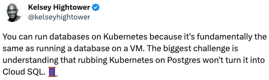

Truth is that I agree with him now as much as I agreed with him back then. At
that time, the holistic offering of storage capabilities in Kubernetes was
still  immature (local persistent volumes would become GA only the year after),
the operator pattern - which in the meantime has proven to be crucial for
stateful applications like databases - was yet to become widely accepted, and
the [Data on Kubernetes Community](https://dok.community/) was more than two
years away (second half of 2020).

Nowadays, the situation is completely different. And I am sure that many people
who’ve worked hard in the last few years to bring stateful workloads in
Kubernetes agree with me that Kelsey’s recent powerful words will contribute to
reversing the public perception and facilitate our mission - provided we keep
doing great.

My personal opinion goes even further: provided some requirements are met,
running PostgreSQL in Kubernetes is better than on VMs - where it’s been
recently voted [the world’s most popular database management system](https://www.enterprisedb.com/blog/postgres-most-admired-database-in-stack-overflow-2023).

## Kubernetes, PostgreSQL, CloudNativePG

Specifically, my mission since 2019 has been to help improve the Postgres
experience in Kubernetes and in Cloud Native organizations. With my amazing
team we decided to push the limits of local storage in Kubernetes and see how
it was performing, compared to bare metal and VM solutions that we had been
deploying for over a decade on some of the largest installations of PostgreSQL
around the world. As part of the pilot project, at the end of 2019 we ran some
benchmarks on a bare metal Kubernetes cluster to understand if such an
initiative was worth it, following a fail-fast approach. Results went beyond
our expectations and were [later published in a blog article](https://www.2ndquadrant.com/en/blog/local-persistent-volumes-and-postgresql-usage-in-kubernetes/).
That’s when we started to realize that running Postgres in Kubernetes presented
the same challenges for storage as running it in bare metal or VM scenarios,
but it required three fundamental things:

- Kubernetes knowledge within your team or organization
- PostgreSQL knowledge within your team or organization
- A reliable operator to manage the entire lifecycle of a PostgreSQL database cluster in high availability

Given that I am a maintainer of a rapidly growing open source operator
([CloudNativePG](https://github.com/cloudnative-pg/cloudnative-pg)) and that
I’m primarily engaged with customers and users that have PostgreSQL background,
in this article I assume that the two latter requirements are met, and focus on
the Kubernetes aspect.

First of all, it is important to clarify an aspect: Kubernetes helps you solve
the wider and more complex problem of a **virtual data center** - not just a VM
provisioning service, with the given proportions.

Obviously if you choose a self-managed on-premise Kubernetes environment you
are making the conscious decision to invest in people and skills that will help
your organization push down most of the business continuity requirements and
issues at the infrastructure level, in a standard way. Adopting a public cloud
managed Kubernetes service with 3+ availability zones will definitely reduce
your investment in this area, but you’ll still need T-shaped people that
understand Kubernetes in your multidisciplinary stream-aligned team, or as part
of a platform team that is shared by multiple teams in your organization (as
defined by [Skelton and Pais in “Team topologies”](https://teamtopologies.com/book)).
 The good news is that Kubernetes can be learnt. The other good news is that
Kubernetes provides you with a standard infrastructure that you can then easily
move in a public cloud, or private (the two most common patterns I am seeing
these days with our customers) and then progressively explore hybrid or
multi-cloud distributed strategies, offering a priceless solution against Cloud
Service Provider vendor lock-in as well as negotiating power.

As a result, my advice is to stay away from the temptation to “lift-and-shift”
databases from traditional environments in Kubernetes - unless they are
conscious intermediate decisions in a long-term journey. Kubernetes skills in
the initial phase of your journey are critical: decisions made here are hard,
if not impossible, to change at a later stage. However, this is the common
issue that systematically surfaces when the goal (a Cloud Native aware
organization) is also the means of a transformational change, and we are not
able to address a problem we cannot (yet) see. 

If you are reading this blog article, and you are thinking about using Postgres
in a Cloud Native environment, without any Kubernetes background, my advice is
to seek immediate [professional assistance of a certified service provider](https://kubernetes.io/partners/#kcsp)
from day 0 - just because everyone is going on Kubernetes doesn’t mean that’s
necessarily a good idea for your organization!

And even if you get professional assistance, make sure that you show this
article to the Kubernetes experts that will help you on the architectural
decisions, as they might not be fully familiar with running stateful workloads
like PostgreSQL inside Kubernetes.

I believe that you might find very insightful information in the “[Cloud Native Disaster Recovery Whitepaper](https://github.com/cncf/tag-storage#cloud-native-disaster-recovery-whitepaper)”
produced by the Storage Technical Advisory Group (TAG) within the CNCF,
providing you with foundational terminology and concepts that will help you
better understand this article.

## Kubernetes architectures

Kubernetes has been designed to run across different availability zones and to
automatically provide resilience over the failure of one data center (or more,
even simultaneously). The requirement is that these data centers are
interconnected with high-bandwidth, low-latency and redundant networking. When
this happens, Kubernetes’ control plane is shared on nodes that exist in
different data centers, and, similarly, Kubernetes’ workloads such as web
applications or Postgres databases. All major cloud providers offer Kubernetes
services that span across at least 3 availability zones within the same region.

Some vendors call these “stretched” Kubernetes clusters: as an example of
guideline, [Red Hat for example recommends stretched OpenShift clusters](https://access.redhat.com/documentation/en-us/red_hat_openshift_data_foundation/4.13/html/configuring_openshift_data_foundation_disaster_recovery_for_openshift_workloads/introduction-to-stretch-cluster-disaster-recovery_stretch-cluster)
only when latencies don’t exceed 5 milliseconds (ms) round-trip time (RTT)
between the nodes in different locations, with a maximum RTT of 10 ms.

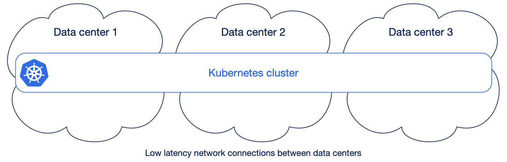

However, in conversations with our customers having on-premise installations, I
am still seeing a 1:1 mapping between availability zone/data center and
Kubernetes cluster, even when data centers are in the same city or metropolitan
area (often one of them is in a separate building across the road). So:

- If you have one data center, you have one Kubernetes cluster (obvious)
* If you have two data centers, you have two separate Kubernetes clusters
  (understandable, but debatable)
- If you have three data centers, you have three separate Kubernetes clusters
  (very arguable)

The above is probably explained by two reasons:

- “Lift and shift” operation: we already have two data centers with traditional
  VM/bare metal environments, and we use the same paradigm here when moving to
  Kubernetes
- Stateless mindset: the opinion that Kubernetes is only for stateless
  applications is still predominant; the database should run outside (in a VM
  or as a service) and if you run stateful workloads, you use the storage
  capabilities to replicate across clusters

While I understand the first case, I believe we need to start pushing
organizations all over the world that are planning to run Kubernetes on
premises, to plan for 3 or more data centers in their regions, and emulate what
Cloud Providers have been doing for over a decade. Shifting from 2 to 3+ data
centers adoption won’t happen overnight, but it’s important to start planning
now.

When it comes to the second case, we need to consider that the application we
are referring to is PostgreSQL. For over 15 years, PostgreSQL has been
regularly enhancing, year after year, major version after major version, its
native support and performance for both physical and logical replication.
Physical replication is the foundation of both:

- [Disaster recovery through continuous backup and Point In Time
  Recovery](https://www.postgresql.org/docs/current/continuous-archiving.html),
  requiring periodical base backups and the never ending stream of WAL files
  (Postgres’ transaction logs) to be safely stored and archived in alternate
  locations like object stores
- [High availability through the single primary/multiple read-only replicas
  architecture](https://www.postgresql.org/docs/current/high-availability.html)
  based on one of the most advanced and reliable replication protocols which,
  among the others, includes support for synchronous replication (controlled at
  single transaction level), cascading replication, and read consistency

All of these features come out of the box with Postgres, and are natively
supported by the CloudNativePG operator.

My advice for running Postgres in Kubernetes is then to:

- Rely on PostgreSQL replication to synchronize the state within and across
  Kubernetes clusters - in Kubernetes lingo: choose application level
  replication (Postgres), instead of storage level replication
- Fully exploit availability zones in Kubernetes, instead of “siloing” data
  centers in separate Kubernetes clusters, in order to automatically achieve
  zero data loss with very low RTO high availability within a single region,
  out-of-the-box

In each section below you’ll find more specific information and details about
some of the most common use cases you can encounter.

### Two separate single data center Kubernetes clusters

In case you cannot go beyond two data centers and you end up with two separate
Kubernetes clusters, don’t despair.

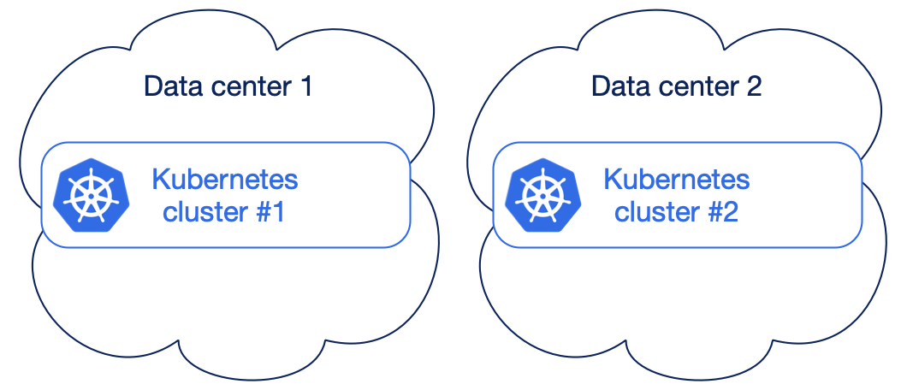

You are accepting that you are treating one data center as primary, and the
other one as Disaster recovery, in a somehow active/passive scenario. You’re
also accepting that you need to coordinate activities across these two data
centers (substituting yourself to a basic Kubernetes task in a multi-AZ
stretched cluster) and that you might eventually need to perform manual
operations in case of unexpected failure of the primary data center - this
could even happen at a regular cadence, due to your business continuity and/or
disaster recovery plans requiring simulations every 3 to 6 months for example.

The good thing is that, even if not optimal, you can still achieve very good
results in terms of RPO/RTO for Postgres, as long as you remove as many Single
Points of Failure (SPoFs) in each data center. For example, if possible, make
sure that the Postgres instances in the same data center do not share anything
but the network, by scheduling them on different worker nodes and on different
storage. These are generally good recommendations in any case, but here they
are critical - as you cannot exploit automated failover across multiple data
centers as seamlessly supported in a stretched Kubernetes cluster.

CloudNativePG provides a feature called “Replica clusters” through which you
can re-create a symmetrical Postgres architecture in the other data center. A
replica cluster is in continuous replication and ready to be manually promoted
- even without an active streaming replication connection, just by fetching WAL
files from the object store. I’ll cover replica clusters more deeply in the
“Beyond the single Kubernetes cluster” section below.

### Shared workloads, shared storage

From a bird’s eye view, and leaving aside Availability Zones for a moment, the
entry level for running PostgreSQL in Kubernetes is the “share everything”
approach. You treat Postgres as any other application by letting the Kubernetes
scheduler place your databases wherever there’s availability based on the
requested resources and by sharing the same network storage (even though you
might question it, that’s a SPoF).

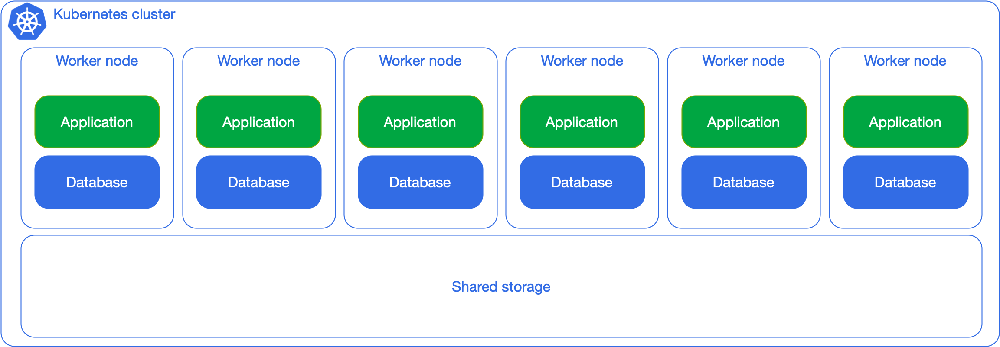

This solution works fine as long as you don’t expect predictability in terms of
performance, primarily business continuity (RTO and RPO) and number of
transactions per second (TPS).

The next level is to separate the Kubernetes worker nodes for PostgreSQL
workloads from the other workloads’, using Kubernetes’ native scheduling
capabilities, such as affinity, anti-affinity, node selectors and taints.
You’ll still insist on the same storage, but you can get more predictability in
terms of CPU and memory usage.

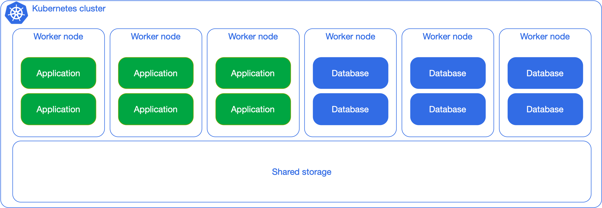

When Postgres adoption increases in your organization, you can start thinking
about dedicating network storage for the database workloads, as in the next
diagram. Although the separation is primarily logical, the general idea here is
to show you how flexible you can be, as long as you have clear expectations in
terms of RTO/RPO/TPS as well as overall costs.

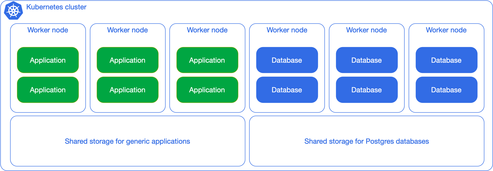

However, based on many years of Postgres experience, my advice is to try and
avoid the “shared everything” solutions proposed above for production usage.

### Shared workloads, local storage

Things start to get more interesting for database lovers when you begin
considering local storage adoption. This applies to any possible environment
from public cloud to bare metal nodes with dedicated hardware, including
[NVMe](https://en.wikipedia.org/wiki/NVM_Express) drives. The example below
shows a clear separation in terms of Postgres workloads and non-Postgres
workloads, and relies on local persistent volumes that are mounted on the
worker nodes dedicated to Postgres. This allows you to differentiate between
shared storage for non Postgres workloads (stateless and stateful) and local
storage for PostgreSQL, which doesn’t need to be replicated at the storage
level (and shouldn’t!).

Consider indeed the example of a Postgres cluster with a primary and two
replicas, at least one of them in synchronous replication (RPO=0), each in a
different worker node with local storage. Postgres replication ensures that the
state of the entire cluster is immediately available in at least another node,
reducing the risk of data loss. Your single point of failure immediately
becomes the data center - or even the region if the worker nodes are in
different availability zones within a low latency network. Without having to do
anything, just configuration.

By adding replication at the storage level you are not improving by any inch
your business continuity outcomes, and are actually degrading performance by
introducing the effect known as write amplification. If you are interested,
watch the talk that I gave with Chris Milsted from Ondat (now Akamai) at
KubeCon NA 2022 in Detroit with title
[“Data On Kubernetes, Deploying And Running PostgreSQL And Patterns For Databases In a Kubernetes Cluster”](https://www.youtube.com/watch?v=99uSJXkKpeI&ab_channel=CNCF%5BCloudNativeComputingFoundation%5D),
in which we provide evidence of reaching over 18k OLTP-like transactions per
second in a Postgres synchronous cluster in Kubernetes, with no data loss after
sudden failure of the primary (and almost instantaneous automated promotion of
the standby).

From a backup and recovery point of view, you can at the same time rely on
Postgres native capabilities on object stores (where RPO is normally 0 for
Point-In-Time recovery and maximum 5 minutes for regional disasters) or
Kubernetes native backup solutions like Velero, Kasten, and similar.

This scenario can be easily achieved with taints and tolerations, through which
you can clearly limit your Postgres workloads on specific dedicated nodes,
either virtual or physical. For example, a good compromise is to start with a
dedicated node in each availability zone, with a minimum of 3 nodes -
especially when your Kubernetes cluster architecture has been already designed.

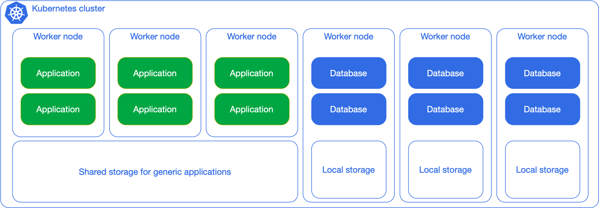

### Dedicated workloads, local storage

Suppose you have a very large and critical database that you want to pay
special attention to, you can dedicate a single worker node to it, as in the
diagram below:

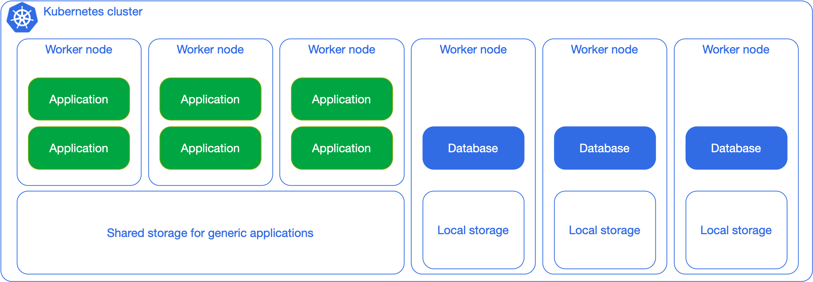

As a Postgres fanatic, this is by far my favorite scenario - if you recall from
the start of this article, this was the exact use case that we wanted to
validate in the initial pilot project. It is the perfect example of merging the
two worlds: databases requiring full control and Kubernetes requiring full
automation. In distributed database management systems this architecture is
also known as shared nothing architecture.

The dedicated worker node per Postgres instance in 3 different availability
zones, with at least a synchronous replica, in a single Kubernetes cluster (see
diagram below)  is without any doubt the best experience of running Postgres
that I have ever seen in my 15+ professional career, from day 0 to day 2.

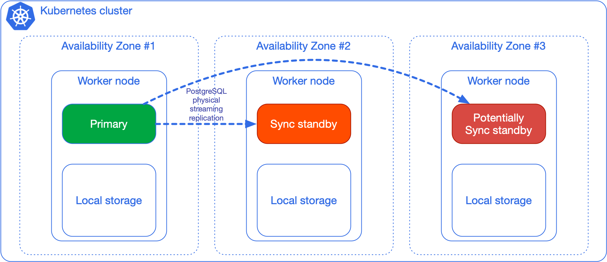

### Beyond the single Kubernetes cluster

The same architecture that you have adopted in a single Kubernetes cluster, can
be replicated in one or more regions. The diagram below shows a PostgreSQL
cluster with a primary and two standby servers (one synchronous) on the left
side. Continuous backup is in place, with the primary archiving WAL files at
least once every 5 minutes in an object store in the same region of the
cluster, and physical base backups being stored periodically (once a day or a
week, depending on your needs). The object store could be either in the public
cloud, or internal to the cluster - to be relayed in a public cloud service or
in a remote location using the selected object store capabilities for long term
retention.

The Postgres cluster on the right side is called a replica cluster in
CloudNativePG terminology. As you can see, there’s a symmetrical architecture
with a designated primary from which the local replicas are kept in
synchronization through native streaming replication - a designated primary  is
a standby that is ready to become primary in case of failure of the primary
region. As you can see, a regional object store is configured to receive
continuous backup data (namely base backups and WAL files).

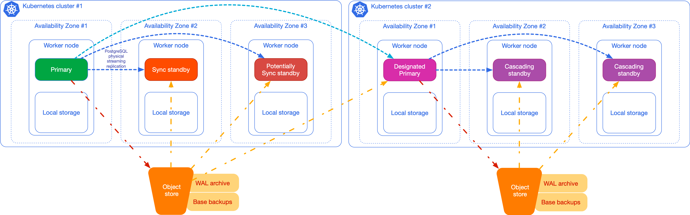

Just by relying on Postgres replication, you easily have backup objects in two
regions.

Moreover, the replica cluster can be kept in sync just by fetching WAL files
from the origin’s object store (the one on the left, provided the cluster on
the right has read permissions), without any active streaming replication, by
using a capability that’s been available in PostgreSQL since 2006, when version
8.2 with warm standby was released. Out of the box, in CloudNativePG, this
feature provides a maximum of roughly 5 minutes RPO for cross regional disaster
recovery. Depending on the network and your database workloads, you can reduce
RPO to almost 0 across regions by enabling streaming replication between the
primary and the replica cluster, using mTLS and a secure channel between the
two endpoints.

You can add more replica clusters, in cascading replication, if you need to.
The following sketch highlights an example of a Postgres cluster replicated in
3 regions (for example America, Europe and Asia Pacific).

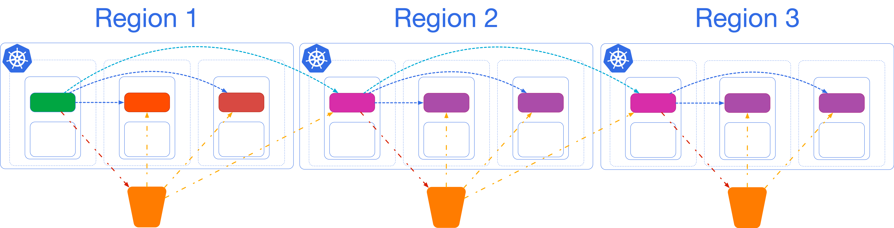

As mentioned at the start, replica clusters are the only option with a low RTO
that can save you from data center failures in case of a single availability
zone Kubernetes cluster.

## Conclusions

The few scenarios that I have highlighted in this blog article are not meant to
be an exhaustive list of possible architectures. My advice is to consider the
two extremes from shared everything to shared nothing, and choose based on your
goals and budget allowance.

I briefly touched the storage part in this article: storage requires separate
discussions and the key takeaway here is that when it comes to Postgres you
should use the database replication system to synchronize the state across a
distributed system like Kubernetes, within and beyond a single cluster. I’ll
certainly write a separate article about this topic in the future, considering
also that CloudNativePG is adding declarative support for Postgres tablespaces
and for Kubernetes `VolumeSnapshot` API to introduce incremental and
differential backups on Very Large DataBases (VLDB).

I will also be speaking about “[Disaster Recovery with Very Large Postgres
Databases](https://sched.co/1R2ml) “ at KubeCon NA 2023 in Chicago on November
7 with Michelle Au (Google and Kubernetes storage expert).

Properly planning from Day 0 your Postgres experience in Kubernetes will
provide an unprecedented opportunity to create a fast-flow highway between the
application developers and the end user of an application through automated
continuous delivery and deployment pipelines that include the microservice
database (GitOps).

Going back to Kelsey’s statement, I not only think that we can run databases on
Kubernetes because “it's fundamentally the same as running a database on a VM”,
but I believe that through the CloudNativePG operator we all can run Postgres
databases better than on a VM. Relying on solid open source technologies like
PostgreSQL and Kubernetes, and by leveraging on the extremely powerful (yet
often forgotten) standard SQL language, Postgres can be a foundational solution
for Cloud Native applications in every sector.

CloudNativePG is a project initially created by EDB,
[open sourced in May 2022](https://www.enterprisedb.com/blog/introducing-cloudnativepg-new-open-source-kubernetes-operator-postgres)
and now openly governed by a vendor-neutral community.

If you are interested in improving the Postgres in Kubernetes experience,
participate in this community at
[cloudnative-pg.io](https://cloudnative-pg.io/) or directly on
[GitHub](https://github.com/cloudnative-pg/cloudnative-pg).

_Note: this article was first published on the [CNCF blog on September 29th,
2023](https://www.cncf.io/blog/2023/09/29/recommended-architectures-for-postgresql-in-kubernetes/)._

