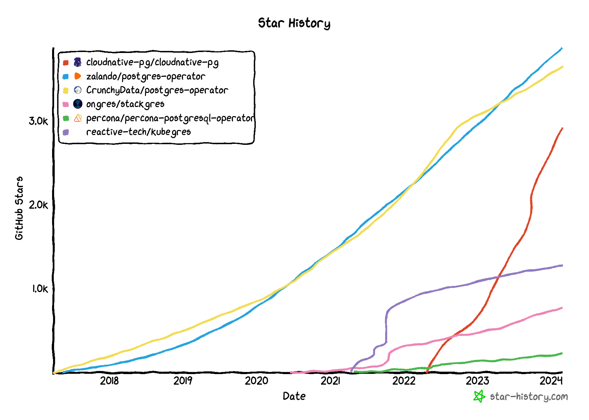
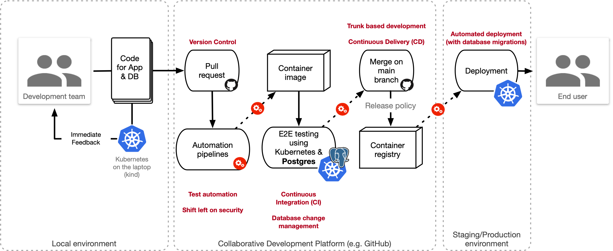

_Explore the synergy between PostgreSQL and Kubernetes through CloudNativePG — a
transformative operator discussed in this article. Discover how this powerful
open source stack empowers organizations to free themselves from vendor lock-in
and to create a seamless microservice database environment, enhancing
innovation, operational efficiency and velocity. This article provides a
refreshed perspective on
"[Why Run Postgres in Kubernetes?](https://cloudnativenow.com/kubecon-cnc-eu-2022/why-run-postgres-in-kubernetes/)"
from 2022._

<!--more-->

[PostgreSQL](https://www.postgresql.org/) is this incredible open-source gem
that's been shaking up the database management scene for a cool couple of
decades now.
[Shaped by the genius mind of database science legend Michael R.  Stonebraker](https://www.postgresql.org/docs/current/history.html),
it has blossomed into one of the world's go-to database management systems,
loved in both virtualized and bare-metal setups.

What sets PostgreSQL apart?  Well, every year, with each shiny new
release, it throws in some heavyweight features. Think of standard SQL,
transactional DDL, continuous backup, Point In Time Recovery (PITR), slick
native streaming replication (async/sync, physical/logical), and even
declarative partitioning for sprucing up your table organization game. And
that's just the tip of the iceberg – we're talking extensions galore, like the
geographically fantastic PostGIS, parallel queries for that vertical
scalability swagger, JSON support for those multi-model hybrid databases, and
the list goes on.

But guess what? Despite being a veteran in the game, PostgreSQL is still
stealing hearts and turning heads. Just last year, DB-Engines threw the
[Database of the Year 2023](https://db-engines.com/en/blog_post/106) crown on
its head, leaving a whopping 417 other systems in the dust. And here's the
kicker: [Stack Overflow's 2023 Developer Survey](https://survey.stackoverflow.co/2023/)
spills the juicy details – PostgreSQL has dethroned MySQL as the crowd's
favorite, creating a bit of survey history in the process! That's the
PostgreSQL magic – timeless and still rocking the show.

## PostgreSQL and Kubernetes

When it comes to Kubernetes, the prevailing notion has been to keep databases
at arm's length. Traditionally, the idea of running a robust database like
PostgreSQL within the Kubernetes framework was considered a bit unconventional,
a sort of anti-pattern.  The early stages of Kubernetes were primarily geared
towards the elastic scalability of stateless applications, creating an
environment where databases were perceived as an uneasy fit.

Nevertheless, a shift began with the introduction of Local Persistent Volumes
in Kubernetes 1.14 back in March 2019. This marked a pivotal moment,
challenging the traditional stance and opening doors for databases to coexist
more seamlessly within Kubernetes. The narrative evolved further with the
rising adoption of the operator design pattern. This innovative approach
extended the capabilities of the Kubernetes controller, making it adept at
handling complex applications like databases.

Noteworthy groups such as the [Data on Kubernetes Community (DoK)](https://dok.community)
are actively contributing to shifting perceptions and increasing awareness
about the feasibility of running stateful workloads, such as databases, within
the Kubernetes ecosystem. The winds of change are blowing, and the once rigid
boundaries between Kubernetes and databases are starting to blur.

Based on insights from a survey conducted in September 2022, outlined in the
[Data on Kubernetes 2022 report](https://dok.community/data-on-kubernetes-2022-report/),
the integration of data-related workloads, such as databases, analytics, and
AI/ML, within Kubernetes environments is proving to be a game-changer for
organizations. This shift is not merely a technological adjustment; it's a
transformative force driving increased productivity and revenue gains.

The evolving landscape of Kubernetes is witnessing a convergence towards
stateful workloads, prompting a paradigm shift in database usage patterns.
These emerging trends are thoughtfully detailed in the recently published
[Data on Kubernetes Whitepaper - Database Patterns](https://github.com/cncf/tag-storage/blob/master/data-on-kubernetes-whitepaper/data-on-kubernetes-whitepaper-databases.md),
a comprehensive resource that offers valuable insights into the dynamic and
evolving world of databases within Kubernetes ecosystems _(notably, I am honored
to be one of the authors contributing to this whitepaper)_.

As active contributors to both the PostgreSQL and the Data on Kubernetes
communities, my company (EDB), my team, and I firmly believe in the synergistic
relationship between PostgreSQL and Kubernetes. We see the potential for these
two technologies to enhance each other, offering users the best possible
experience with this open-source database.

From my extensive research over the past few years, it has become evident that
PostgreSQL is best suited to operate within the Kubernetes ecosystem,
coexisting seamlessly with your applications. This recommendation assumes your
organization has already embraced Kubernetes and possesses the essential skills
for both Kubernetes and PostgreSQL. It's worth noting that your support network
can extend to third-party experts providing professional assistance for either
or both technologies. For a deeper dive into this topic, check out my blog
article on ["Recommended Architectures for PostgreSQL in Kubernetes"](https://gabrielebartolini.it/articles/2023/09/recommended-architectures-for-postgresql-in-kubernetes/),
where I delve into various insights gleaned from years of experience in the
field.

## The need for an operator

In addition to being well-versed in Kubernetes and PostgreSQL, a crucial third
requirement comes into play: the need for an operator.

Within the Kubernetes framework, a database takes on the role of a distinct
application, distinguished by the critical importance of data as the
organization's primary asset. This elevated status demands careful attention,
fostering a deep understanding of Postgres architectures, worker node
CPU/memory resource utilization, and storage intricacies. Such comprehension is
pivotal for ensuring optimal performance and data reliability.

Contemporary considerations challenge the idea of running PostgreSQL purely as
a container within a pod, relying solely on Kubernetes for resource management,
self-healing, and storage-level data replication, deeming it impractical. This
approach overlooks the extensive decade-long evolution of this open-source
database management system, particularly in the realm of business continuity,
along with the accrued experience of DBAs over the years.

What is indispensable is an operator that, in our vision, encompasses all of
the above, addressing the entire lifecycle of a database. This operator employs
declarative configuration and relies on PostgreSQL's native streaming
replication for primary/standby architecture, including synchronous
replication. Synchronous replication can be dynamically tuned at the ACID
transaction level, catering to the nuanced demands of contemporary database
management, and potentially serving as a launchpad for downstream analysis and
AI applications.

This operator should harness PostgreSQL's inherent capabilities for continuous
backup and point-in-time-recovery (PITR), ensuring optimal outcomes in
scenarios involving unforeseen hardware failures or human errors, such as an
`UPDATE` query without a `WHERE` condition.

It seamlessly integrates with the standard capabilities provided by Kubernetes,
leveraging features like affinity control, or volume snapshots in the storage
domain.

Attaining recovery point objectives (RPO) nearing zero within the same data
center or consistently below 5/10 minutes across regions becomes markedly
achievable through open-source stacks based on Kubernetes and PostgreSQL,
skillfully managed by a proficient operator.

Security, being of utmost importance, must be woven into every facet of the
operator and its development cycle. Utilizing the full spectrum of capabilities
in both Kubernetes and PostgreSQL, beginning with TLS connections and TLS
client authentication, is crucial. Integration with CNCF ecosystem tools like
cert-manager further enhances security measures. Regular updates, encompassing
both the operator image and operand images containing PostgreSQL, serve as a
vital layer of defense. Whether triggered by a new minor version release of
PostgreSQL (e.g., from 16.1 to 16.2) or the availability of a container image
addressing known vulnerabilities, a robust PostgreSQL operator should
seamlessly execute rolling updates. This involves a systematic replacement of
the container image in each replica, followed by a switchover of the primary on
the most aligned replica, concluding with the realignment of the former primary
to the current one. All of this is automated for efficiency, ensuring minimal
downtime (of the good, healthy kind) and no data loss.
The operator is built upon the principles of
[immutable application containers](https://www.enterprisedb.com/blog/why-edb-chose-immutable-application-containers).
This design ensures that only a single process, serving as the entry point (the
application), runs within the container, and the container's content remains
unmodifiable.

Each PostgreSQL cluster should serve as a responsible participant within both
the Kubernetes cluster and the overarching IT infrastructure. This involves the
establishment of robust troubleshooting processes and the seamless integration
of monitoring, logging, and audit functionalities.
This approach aligns not only with specific elements of
[Jeff Carpenter's Cloud Native database maturity level 2](https://containerjournal.com/topics/a-maturity-model-for-cloud-native-databases/)
but also resonates more broadly with the overarching concept of
Kubernetes-native databases, as described by Carpenter and Patrick McFadin
in their collaborative book, ["Managing Cloud Native Data on Kubernetes"](https://www.oreilly.com/library/view/managing-cloud-native/9781098111380/).

## CloudNativePG

These foundational ideas, concepts, and essential requirements have guided the
evolution of the [CloudNativePG](https://cloudnative-pg.io) operator. These
considerations have shaped the trajectory of the project since its inception in
2019 during my tenure at 2ndQuadrant. In February 2021, the operator marked a
significant milestone by being formally launched as a product at EDB under the
name Cloud Native PostgreSQL.
Subsequently, in [May 2022](https://www.enterprisedb.com/blog/introducing-cloudnativepg-new-open-source-kubernetes-operator-postgres),
the project took a strategic shift, transitioning into an open-source
distribution under the Apache License 2.0. This pivotal move was facilitated by
EDB's commitment to contribute the project to a vendor-neutral and openly
governed community, setting the stage for the pursuit of the CNCF graduation
process—a testament to our dedication to long-term community collaboration and
development.

As both a co-founder and maintainer of the CloudNativePG project, and a
longtime enthusiast of both PostgreSQL and Kubernetes, I wholeheartedly
advocate for this operator. Technically classified as a
[level 5 Kubernetes Operator](https://cloudnative-pg.io/documentation/current/operator_capability_levels/),
CloudNativePG excels in managing PostgreSQL clusters, seamlessly handling day 0
through day 2 operations, and is production-ready.

Impressively, CloudNativePG stands out as the fastest-growing Postgres
operator, collecting around 2,900 stars within a mere 21 months from its
open-source launch. It is also recognized as the most popular Postgres
operator, according to the [Timescale's 2023 State of PostgreSQL survey](https://www.enterprisedb.com/blog/cloudnativepg-the-most-popular-postgres-operator-in-2023).

On the technical front, CloudNativePG distinguishes itself by being exclusively
designed for Kubernetes. It seamlessly extends the Kubernetes controller,
introducing a custom resource called `Cluster` responsible for managing the
Postgres cluster's status. This resource relies on a component called the
[*instance manager*](https://cloudnative-pg.io/documentation/current/instance_manager/)
to exert precise control over the underlying PostgreSQL instances.

A notable aspect is the inclusion of failover management within CloudNativePG,
eliminating the need for external tools like Patroni when providing High Availability.
The decision to bypass statefulsets and [directly manage PVCs](https://cloudnative-pg.io/documentation/current/controller/)
allows for finer control over the Postgres cluster.

CloudNativePG adopts a fully declarative approach, leveraging the Kubernetes
API to facilitate seamless integration with applications. This includes
services, mutual TLS via secrets, affinity control, persistent volumes,
[volume snapshots](https://www.enterprisedb.com/postgresql-disaster-recovery-with-kubernetes-volume-snapshots-using-cloudnativepg),
and more.

Out of the box, CloudNativePG offers observability through endpoints for native
[Prometheus exporters](https://cloudnative-pg.io/documentation/current/monitoring/),
as well as [direct log stream in JSON format to stdout](https://cloudnative-pg.io/documentation/current/logging/).

Key features encompass [continuous backup](https://cloudnative-pg.io/documentation/current/backup/)
and [point-in-time recovery](https://cloudnative-pg.io/documentation/current/recovery/),
[rolling updates](https://cloudnative-pg.io/documentation/current/rolling_update/),
[fencing](https://cloudnative-pg.io/documentation/current/fencing/),
[hibernation](https://cloudnative-pg.io/documentation/current/declarative_hibernation/),
along with the ability to replicate across Kubernetes clusters, also known as [replica clusters](https://cloudnative-pg.io/documentation/current/replica_cluster/).

CloudNativePG features a powerful [`kubectl` plugin known as `cnpg`](https://cloudnative-pg.io/documentation/current/kubectl-plugin/),
serving as the official command-line interface (CLI) for the product. It is
compatible with any supported Kubernetes distribution and can be effortlessly
tested on your laptop using `kind` (Kubernetes in Docker), as outlined in the
[quickstart](https://cloudnative-pg.io/documentation/current/quickstart/).

## The microservice database opportunity

Harnessing CloudNativePG to operate Postgres databases within Kubernetes
represents a groundbreaking opportunity for organizations to fully capitalize
on the benefits of developing, deploying, and managing microservice
applications within a Cloud Native environment.
This impact is further amplified when aligned with a
[Westrum generative organizational culture](https://dora.dev/devops-capabilities/cultural/generative-organizational-culture/),
as emphasized by the latest insights from the
[DORA “State of DevOps 2023” report](https://www.devops-research.com/research.html#reports).
This consistent trend, corroborated by past reports, underscores the profound
significance of this assertion.

The incorporation of technical capabilities such as
[source version control](https://dora.dev/devops-capabilities/technical/version-control/),
[trunk-based development](https://dora.dev/devops-capabilities/technical/trunk-based-development/),
[continuous integration](https://dora.dev/devops-capabilities/technical/continuous-integration/),
[continuous automated testing](https://dora.dev/devops-capabilities/technical/test-automation/),
[continuous delivery](https://dora.dev/devops-capabilities/technical/continuous-delivery/),
[deployment automation](https://dora.dev/devops-capabilities/technical/deployment-automation/)
[database change management](https://dora.dev/devops-capabilities/technical/database-change-management/), and
[shifting left on security](https://dora.dev/devops-capabilities/process/shifting-left-on-security/)
empower application developers to independently create microservice-based
applications that seamlessly integrate with their associated databases.

These databases, managed by CloudNativePG in Kubernetes, foster collaboration among
developers, PostgreSQL DBAs, and Kubernetes administrators within a
multidisciplinary team responsible for both the application and its underlying
database. This collaborative approach entirely removes tightly coupled
dependencies typical of siloed environments and reduces the collective
cognitive load, enhancing overall agility.

Extending the microservice architecture to embrace the Postgres database, aptly
named the **microservice database**, establishes a seamless link between
developer innovation and customer experience. Automated GitOps pipelines
streamline the journey from source code commits to immutable application
containers, engaging in automated tests directly within Kubernetes (e.g., with
the use of `kind`). This process ensures both quality and security while
conducting integration tests.

In this microservice database paradigm, applications effortlessly assume
control of a PostgreSQL `Cluster` resource managed by CloudNativePG. This
cluster hosts a single database, known as the application database, and is
owned by the user responsible for executing migrations—the application user.
Crucially, this default setup avoids exposing *superuser* capabilities,
effectively mitigating unnecessary security risks for the database system.

Subsequent deployment to production environments, employing canary or
blue/green deployment strategies, further streamlines the development process.
Database changes are managed as migrations, leveraging Postgres' support for
transactional DDL, which ensures atomicity and preserves the database integrity
in the event of migration failures.

Kubernetes’ foundational principles of infrastructure abstraction, immutable
containers, and declarative configuration eliminate discrepancies between
development, staging, and production environments, thereby significantly
accelerating development velocity.

## Conclusions

Returning to the fundamental question of "why run PostgreSQL in Kubernetes,"
the rationale extends beyond technical considerations, catering to diverse
personas. While developers may be enticed by PostgreSQL's versatility in
managing both relational and unstructured data using SQL, Kubernetes
administrators find appeal in declarative configuration and the immutability
offered by the chosen Postgres operator.

Yet, a more nuanced perspective emerges, one targeting executive-level
individuals and emphasizing an organizational culture centered on humanity over
technology. The prospect arises to enhance the organization's well-being and
happiness by crafting disruptive applications that promptly deliver value to
customers. This transformation is realized by securely storing data in a PostgreSQL
database within a Cloud Native infrastructure based on Kubernetes and its
ecosystem.

Surprisingly — and without going into much detail here — these principles align
seamlessly with the concepts of *slowification* and *simplification* in layers
1 (technology) and 2 (tools and processes) articulated by Gene Kim and Steven
J. Spear in their groundbreaking book, ["Wiring the Winning Organization"](https://itrevolution.com/product/wiring-the-winning-organization/),
published in November 2023.
In organizations fostering a Westrum generative culture, Cloud Native
technologies and the microservice database not only align with but actively
promote slowification, ushering in a transformative journey from what they call
*Danger Zone* to the *Winning Zone* — a psychologically safe environment where
innovation thrives. For deeper insights, I strongly recommend delving into this
insightful book.

The Kubernetes/PostgreSQL/CloudNativePG open-source stack provides unparalleled
freedom of choice, mitigating the risk of vendor lock-in across various
dimensions:

- Choose between on-premise, public cloud, hybrid cloud, or multi-cloud Kubernetes deployment.
- Opt for Kubernetes clusters managed internally or by third-party providers such as EKS, AKS, or GKE.
- Decide on self-managed PostgreSQL or enlist support from external organizations.
- Embrace "vanilla" Kubernetes or opt for third-party Kubernetes distributions.
- Deploy Kubernetes on VM-based environments or bare metal.
- Adopt shared architecture for PostgreSQL instances on the same worker or a
  shared-nothing architecture dedicated to a single PostgreSQL instance,
  potentially with directly attached storage.

The power to make these choices is now in your hands.
