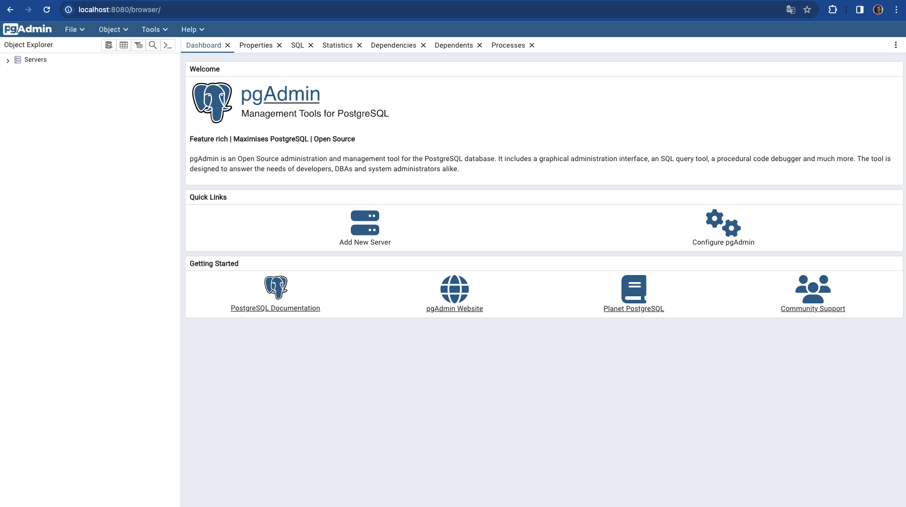
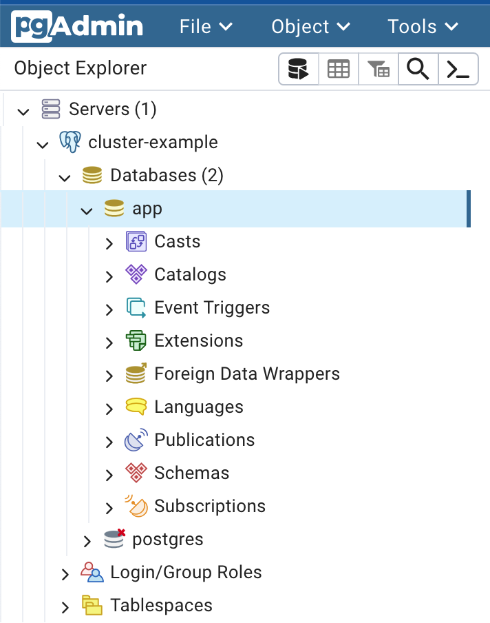

_The article explores the deployment of pgAdmin4, a popular graphical user
interface for PostgreSQL, within a CloudNativePG environment, primarily for
evaluation and educational purposes. The process involves deploying pgAdmin4 to
connect to a PostgreSQL cluster, navigating its interface, and utilizing SQL
functionality. The article provides detailed deployment instructions and
highlights the use of the `--mode desktop` option for seamless integration._

<!--more-->

---

In our journey through CloudNativePG, we've established a robust local
playground for PostgreSQL. Although I'm primarily a command-line person and
normally rely on `psql`, in recipe #4 we delve into the realm of graphical user
interfaces by connecting our PostgreSQL cluster to [pgAdmin4](https://www.pgadmin.org/)
— one the most popular open source web administration tools for Postgres.

## Scope

Before we proceed, it's crucial to emphasize that the deployment of pgAdmin4
outlined in this recipe is solely intended for evaluation, demonstration, and
educational purposes. For production environments, deploying pgAdmin4 requires
proper attention to security measures and configurations, as any other web
application.

## Before You Start

Ensure you've set up your CloudNativePG cluster locally as detailed in
[Recipe #1]().
Additionally, make sure you have the `cnpg` plugin for `kubectl` installed.
We'll be operating under the assumption that you've already installed the
`cluster-example` PostgreSQL cluster within your local `kind` Kubernetes
cluster.

## Deploying pgAdmin4

Our objective now is to deploy pgAdmin4, configured to connect directly to our
`cluster-example` primary via the `cluster-example-rw` service, using the `app`
user credentials. This user, featured in [Recipe #2](),
is the designated owner of the
`app` database — the heart of our microservice architecture.

Execute the following command:

```sh
kubectl cnpg pgadmin4 --mode desktop cluster-example
```

Upon execution, you'll receive a set of instructions guiding you through the
process:

```console
ConfigMap/cluster-example-pgadmin4 created
Deployment/cluster-example-pgadmin4 created
Service/cluster-example-pgadmin4 created
Secret/cluster-example-pgadmin4 created

Easily reach the new pgAdmin4 instance by forwarding your local 8080 port using:

kubectl rollout status deployment cluster-example-pgadmin4
kubectl port-forward deployment/cluster-example-pgadmin4 8080:80

Then, navigate to http://localhost:8080 in your browser.

To remove this pgAdmin deployment, execute:

kubectl cnpg pgadmin4 cluster-example --dry-run | kubectl delete -f -
```

Proceed by ensuring the deployment progresses smoothly:

```sh
kubectl rollout status deployment cluster-example-pgadmin4
```

Once deployment completes, forward the pgAdmin4 port (80) to port 8080 on your local system:

```sh
kubectl port-forward deployment/cluster-example-pgadmin4 8080:80
```

## Accessing the database

Access `localhost:8080` via your web browser. You should be greeted with the pgAdmin interface, as depicted in the screenshot below:



Navigate through the left panel to explore the list of databases, including our pivotal `app` database:



You can now open the SQL panel to start playing with the database. If you are new to SQL, this represents a very practical way to experiment with it.

## There's more ...

The `cnpg pgadmin4` command simply helps you deploy standard Kubernetes
resources with the information available in the Cluster resource. If you want,
you can customize this by taking advantage of the `--dry-run` option.

The plugin command provides another mode to deploy pgAdmin4, via the `--mode
server` option (the default). This mode will require authentication before you
connect to pgAdmin4, but it allows you to safely
[connect using a superuser]()
(if you really want to do it!).

Finally, once you are done, remember to free the resources. You can either
destroy your `kind` cluster, or destroy the `deployment` by running the
instructions presented earlier by the operator, in particular:

```sh
kubectl cnpg pgadmin4 cluster-example --dry-run | kubectl delete -f -
```

## Conclusions

In this recipe, we seamlessly integrated pgAdmin4 with our CloudNativePG
PostgreSQL cluster, facilitating effortless administration and exploration.
Leveraging the `--mode desktop` option provided a frictionless experience,
bypassing authentication for swift experimentation.

For further insights and detailed instructions, refer to the [CloudNativePG
documentation](https://cloudnative-pg.io/documentation/current/kubectl-plugin/#using-pgadmin4-for-evaluationdemonstration-purposes-only)
on the `cnpg` plugin.

As usual, if you found this article informative, feel free to share it within
your network on social media using the provided links below. Your support is
immensely appreciated!
