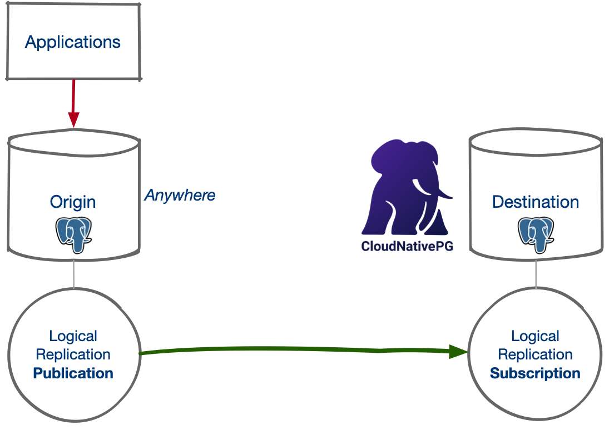
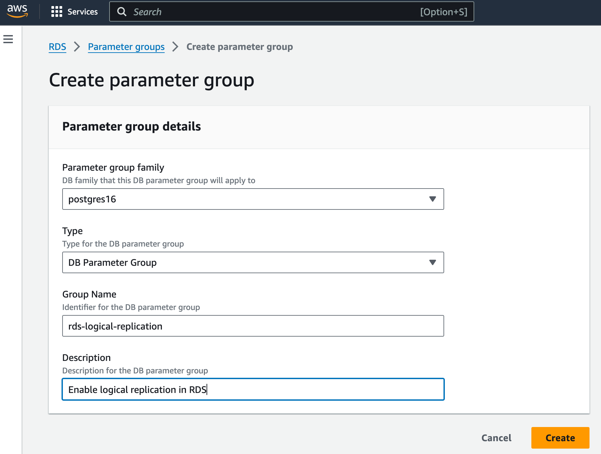
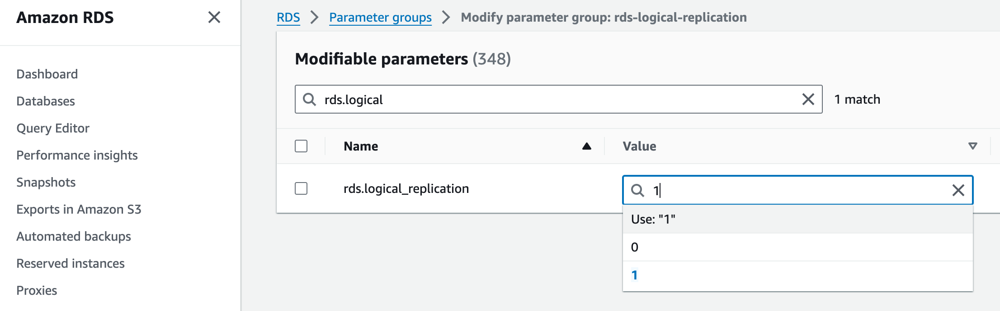
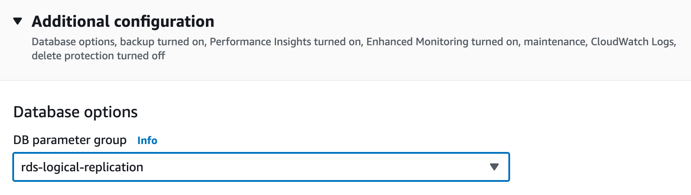

_Are you considering migrating your PostgreSQL database from a service provider
into Kubernetes, but you cannot afford downtime? Recipe #5 details step-by-step
instructions, leveraging CloudNativePG and logical replication, to seamlessly
transition from PostgreSQL 10+ to 16 using an imperative method. Learn how to
set up initial configurations, execute migrations, and handle various use
cases, such as transitioning from DBaaS to Kubernetes-managed databases and
performing version upgrades. Emphasizing testing, learning, and compliance with
regulations like the Data Act, this guide empowers users to maintain control
over their data by migrating to Kubernetes._

<!--more-->

---

In two previous articles, I first covered how to perform an
[offline migration of an existing RDS 10 database to a PostgreSQL database in Kubernetes](https://www.enterprisedb.com/blog/leverage-new-way-import-existing-postgres-database-kubernetes)
using CloudNativePG. Later, I provided a
[status update on online migrations and upgrades](https://www.enterprisedb.com/blog/current-state-major-postgresql-upgrades-cloudnativepg-kubernetes).

In this article, I will show you an imperative way to move an existing
PostgreSQL 10+ database into a PostgreSQL 16 database in Kubernetes with ~0
downtime (or cutover time), using CloudNativePG and the power of Postgres
native logical replication for change data capture (CDC).

> **NOTE:** If you plan to do this activity for testing, please follow the
> instructions in [recipe > #1](https://gabrielebartolini.it/articles/2024/03/cloudnativepg-recipe-1-setting-up-your-local-playground-in-minutes/)
> to have a local “Kubernetes in Docker” environment and the `cnpg` plugin for
> `kubectl` installed.

## About logical replication

Version 10 of PostgreSQL introduced native support for publications and
subscriptions via logical replication. Although very powerful, logical
replication in PostgreSQL still presents some
[limitations](https://www.postgresql.org/docs/current/logical-replication-restrictions.html).
The most notable ones are that PostgreSQL doesn’t replicate:

- Data Definition Language (DDL)
- Data about sequences
- Large objects (LOBs)

Considering that you generally delimit the migration duration in time, with
exact start and finish dates, the only blocker is the last one. The good news
is that CloudNativePG now covers the first two limitations entirely with the
help of the [`cnpg` plugin](https://cloudnative-pg.io/documentation/current/kubectl-plugin/),
as I will show you in this article.

However, this approach will not work if you use large objects and you must
perform an [offline migration](https://cloudnative-pg.io/documentation/current/database_import/).
The rest of this article assumes that limitations don’t apply to your case.

## About near-zero downtime migrations

When migrating a database into a PostgreSQL cluster managed by CloudNativePG in
Kubernetes, your goal is to keep the downtime of your write applications to the
least possible so that users don’t perceive it as a disservice.
We call these “near-zero downtime migrations” or “near-zero cutover time
migrations” in the database world. Some cloud database services call these
[flash-cut migrations](https://docs.aws.amazon.com/prescriptive-guidance/latest/strategy-database-migration/cut-over.html).
I prefer to use **~0 cutover time migrations**.

If your database is small or you can afford some downtime, offline migration
might be your best strategy. Fortunately, if you follow a scientific approach
based on testing and measuring the migration time, you will always succeed,
regardless of your plan.

For example, if your database is in the order of terabytes of data, the offline
migration will not work.

The near-zero downtime migration strategy relies on the concept of change data
capture: the idea is to set continuous logical replication from the origin
database (any network-accessible Postgres 10+ database supporting publications)
to the destination one (in our case, CloudNativePG with a PostgreSQL version
equal or higher than the source one).

From a bird’s eye view, a ~0 cutover time migration to CloudNativePG requires
you to:

1. Complete the initial setup (described in the next section)
2. Ensure that the destination database is in sync with the origin one by verifying the data
3. Stop write operations of the applications at the source (the downtime clock starts ticking)
4. Wait for the queue of changes to be processed at the destination
5. Synchronize the sequences in the destination database
6. Drop the subscription and the publication
7. Deploy the new version of your application pointing to the destination database (the downtime clock stops ticking)

What I like about this approach is that:

- It enables application testing: you can repeat steps 1-6 as often as you
  like. Testing is critical if you have extensions that you need to validate
  with your applications and, most likely, update
- It fosters learning: you can become familiar with this procedure in what
  [Gene Kim and Steve Spear call the winning zone](https://itrevolution.com/articles/moving-from-the-danger-zone-to-the-winning-zone/),
  consequently reducing the risk of failure in the danger zone
- It enables measurement: you’ll know exactly your cutover time, and practice
  will allow you to reduce it! You’ll also be able to measure the impact in
  production caused by the initial synchronization and the continuous replication
  process
- It also provides a practical way to perform major online upgrades of any
  community-supported PostgreSQL database
- It is not in place: there is no risk of prolonged downtime of your
  applications in case of a problem during the migration, causing you to
  recover from a backup.

## Initial setup of the migration

Day 0 of this operation is the most critical phase. When you plan for this
migration, you must ensure that the destination cluster can properly and
securely access the source database via the network.

The most common and straightforward approach is to provide access with
superuser privileges on the source database. We will use the `postgres` user in
this article for simplicity. However, I recommend that you work with PostgreSQL
permissions to create a new user for the migration and ensure that it can
connect with the lowest set of privileges - but this will deviate from the
focus of this article.

The initial setup consists of the following series of one-off operations:

- Ensuring that the CloudNativePG cluster can reach the source database via the
  network with a user that has enough permissions to dump the schema and attach
  a `SUBSCRIPTION` to the above `PUBLICATION`
- Creating the destination CloudNativePG cluster importing only the logical
  schema of the source database
- Creating a `PUBLICATION` in the source database
- Creating a `SUBSCRIPTION` in the destination database to the previously
  created publication
- Ensuring that the subscription is working

The diagram below shows the resulting architecture following the initial setup.



## Main use cases

You can use the ~0 cutover technique to:

- **Transition from DBaaS to managed databases in Kubernetes**: move your
  PostgreSQL database from a DBaaS solution supporting logical replication such
  as Amazon RDS for PostgreSQL, Google Cloud SQL for PostgreSQL, or Azure
  Database for PostgreSQL to a CloudNativePG managed cluster inside Kubernetes
- **Transition from traditional VM/bare metal databases to Kubernetes**: move
  your PostgreSQL database supporting logical replication and located anywhere
  on the network to  a CloudNativePG managed cluster inside Kubernetes
- **Migrate from another Kubernetes operator**: move the databases that are
  already inside Kubernetes but are managed by yourself or by another operator -
  such as [Zalando](https://github.com/zalando/postgres-operator),
  [Crunchy PGO](https://github.com/CrunchyData/postgres-operator),
  [Percona](https://www.percona.com/postgresql/software/percona-operator-for-postgresql),
  or [StackGres](https://stackgres.io/), to cite the most popular - to a
  CloudNativePG-managed cluster
- **Perform major version upgrades of PostgreSQL**: move your existing
  CloudNativePG database to a newer version of PostgreSQL, for example, from 15
  to 16.

## Example of migration from AWS RDS

I could have picked up any use case. But I thought about using the most
interesting and captivating one: RDS. If we can move this, we can move any
PostgreSQL database from anywhere to CloudNativePG, as long as it supports
logical replication and is accessible over the network.

Let’s assume you have a PostgreSQL 16 database in RDS (the PostgreSQL version
here is irrelevant; you could have used PostgreSQL 13, too). You already have
an EKS Kubernetes cluster where your applications run and work with this RDS
database. Your goal is to move the database next to your applications, with no
perceivable downtime, and let CloudNativePG manage it as a PostgreSQL 16 highly
available cluster.

For simplicity, the last assumption is that the database you want to import is
called `app` and that your `postgres` user’s password is `AngusYoung1955`. If
you have more than one database in your RDS instance, you can repeat the
operation for each one at a time.

### Enable logical replication

The first step is to [enable logical replication in your RDS cluster](https://repost.aws/knowledge-center/rds-postgresql-use-logical-replication)
by creating a new parameter group called `rds-logical-replication`, as depicted
in the picture below.



Then, enable `rds.logical_replication`:



And apply to the `rds-logical-replication` parameter group in the database configuration:



> **IMPORTANT:** you need to reboot the database for RDS to enable logical
> replication and set `wal_level`to `logical`. You also need to ensure you can
> reach the database via the network.

### Deploy the destination database

CloudNativePG allows you to define the so-called external clusters. What we are
going to do now is create a new CloudNativePG cluster in which we:

- Define an external cluster called `rds` pointing to our PostgreSQL database
  in RDS using the `postgres` user
- Take advantage of the `schemaOnly` option of the
  [microservice database import capability](https://cloudnative-pg.io/documentation/current/database_import/#the-microservice-type)

First, create the `rds-superuser` secret for the credentials of the `postgres`
user:

```sh
kubectl create secret \
  --dry-run=client -o yaml generic rds-superuser \
  --from-literal=username=postgres \
  --from-literal=password=AngusYoung1955
```

Then, create the following cluster:

```yaml
apiVersion: postgresql.cnpg.io/v1
kind: Cluster
metadata:
  name: angus
spec:
  instances: 1
  storage:
    size: 50Gi
  bootstrap:
    initdb:
      import:
        type: microservice
        schemaOnly: true
        databases:
          - app
        source:
          externalCluster: rds
  externalClusters:
  - name: rds
    connectionParameters:
      host: <HOST>.rds.amazonaws.com
      user: postgres
      dbname: app
    password:
      name: rds-superuser
      key: password
```

Under the hood, CloudNativePG will create the new `angus` cluster with a single
instance and a volume of 50GB for `PGDATA` (feel free to change the storage
configuration at your will). Then, it will connect to the `rds` external
cluster, export the schema, and import it into the `angus` cluster in your
Kubernetes environment.

Verify that CloudNativePG correctly imported the database schema. Otherwise,
you can create an empty cluster and manage the schema yourself.

### Create the publication

The next step is to use the `cnpg` plugin to help you create a publication in
the `rds` database. For simplicity, we create a publication for all the
existing tables.

Important: To define the granularity, check the options for the
[`CREATE PUBLICATION` command in the PostgreSQL documentation](https://www.postgresql.org/docs/current/sql-createpublication.html).

```sh
kubectl cnpg publication create angus \
  --external-cluster rds \
  --publication migration \
  --all-tables
```

The above command will get the connection information from the `rds` external
cluster, then run the following SQL statement in the `app` database in RDS
using the `postgres` user:

```sql
CREATE PUBLICATION "migration" FOR ALL TABLES;
```

Verify that the publication exists in the database of origin.

### Create the subscription

Now that we’ve set the publication in the origin database, we need to set the
subscription in the destination one. The command is once again straightforward:

```sh
kubectl cnpg subscription create angus \
  --external-cluster rds \
  --publication migration \
  --subscription migration
```

CloudNativePG will hide the complexity of creating the connection info to the
RDS cluster and invoke the following SQL statement in your local `angus`
database:

```sql
CREATE SUBSCRIPTION "migration"
  CONNECTION 'dbname="app" host="<HOST>.rds.amazonaws.com" passfile="/controller/external/rds/pgpass" user="postgres"
  PUBLICATION migration
```

One of the cool things about our external cluster support is that the database
will not store any password but simply point to a local password file that is
part of a Kubernetes secret managed by CloudNativePG.

From this moment, PostgreSQL will begin synchronizing data from the origin
database to the destination one in Kubernetes. Remember to keep the database
schema the same until you migrate to the new database. Also, measure the
approximate time it takes for the database to become in sync with the origin -
you can calculate the lag from the source database using the replication slot
information, as follows:

```sql
SELECT confirmed_flush_lsn, pg_current_wal_lsn(), \
  (pg_current_wal_lsn() - confirmed_flush_lsn) AS lsn_distance
FROM pg_replication_slots WHERE slot_name = 'migration';
```

The last thing you can do now is verify that you can update the sequences in
your database:

```sh
kubectl cnpg subscription sync-sequences \
  --subscription migration \
  angus
```

### Cutover

Before you perform the final cutover, I advise you to simulate the cutover at
least once, even though you must repeat all the steps from scratch. Then,
ensure that you increase the number of replicas to 3, have physical backups,
and that the recovery process works for you.

Cutting over in production requires temporarily pausing your application’s
write operations. Wait for the logical subscription to be fully synchronized,
then update the sequences. Verify everything is fine, and deploy the new
application version pointing to the PostgreSQL service for the primary,
`angus-rw`,  in the same Kubernetes cluster’s namespace.

At this point, you can clean up by dropping the publication and the
subscription.

## Conclusions

I hope you enjoyed the above example from RDS and that it gave you an idea of
how to migrate similar databases inside Kubernetes, managed by CloudNativePG.
Nothing major will change whether you move from a DBaaS solution, a VM/bare
metal database, or a PostgreSQL server inside Kubernetes running with another
operator.

The same steps will enable you to perform major online upgrades on a new
Postgres cluster.

You can safely test your applications on the new PostgreSQL cluster without
impacting the production environment. Your overall testing and validation
strategy before production becomes even more relevant in the case of PostgreSQL
extensions. Extensions may require more work than the one shown above, but
logical replication-based migrations are the safest approach, according to my
experience.

The solution provided in this article is imperative, but it is very effective
and “good enough” for most migration and upgrade cases. Our plan in
CloudNativePG is to add support for the declarative configuration of
subscriptions and publications, but only after we introduce declarative
database management (subscriptions and publications are indeed part of a
database, not global objects).

A final word is about the [Data Act from the European Commission](https://digital-strategy.ec.europa.eu/en/policies/data-act),
which has been in force since January 2024. Among its goals is to mitigate the
risk of lock-in at the cloud service provider level and allow customers to
switch seamlessly between providers or take the data back on-premises. The
open-source stack of Kubernetes, PostgreSQL, and CloudNativePG is the perfect
example of how users can retain control of their data with the instructions
provided in this article.

---

_Keep an eye out for future updates! Be sure to follow my
[LinkedIn](https://www.linkedin.com/in/gbartolini/) and
[X](https://twitter.com/_GBartolini_) channels to stay up-to-date. If you found
this article helpful, why not share it with your social media network using the
links below? Your support means a lot!_
