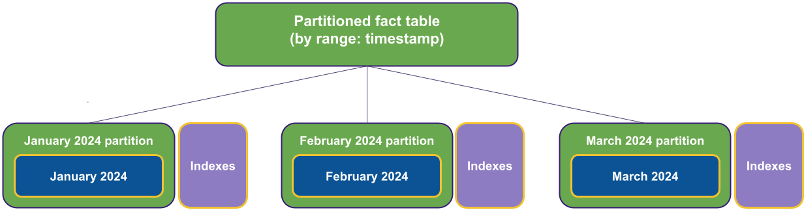
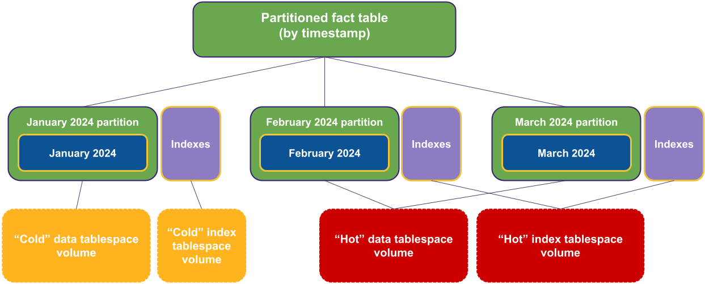

_This is the second article in a series that explores advanced strategies for
scaling PostgreSQL databases in Kubernetes with the help of CloudNativePG. This
article focuses on horizontal table partitioning and tablespaces and how they
can be used to manage large datasets. By partitioning tables based on specific
criteria and optimising storage with tablespaces, PostgreSQL users can achieve
better scalability and performance in cloud-native environments, just like they
could in traditional VMs or bare metal deployments._

<!--more-->

---


In the [previous article](),
I covered some of the main techniques that enable you to leverage the storage
to scale your PostgreSQL databases vertically in Kubernetes using
CloudNativePG.

In this second part, I’ll cover how horizontal table partitioning and
tablespaces can help you scale your PostgreSQL database on a single node.

If you are interested, the ideas presented in this article were discussed in a
talk given by Gari Singh from Google Cloud and me at KubeCon EU 2024 in Paris.
The talk was titled "Scaling Heights: Mastering Postgres Database Vertical
Scalability with Kubernetes Storage Magic", the
[video is available on the CNCF channel on YouTube](https://www.youtube.com/watch?v=LArl0VWxr3Y&ab_channel=CNCF%5BCloudNativeComputingFoundation%5D).


# About horizontal table partitioning

You can skip this section if you're familiar with databases and partitioning.
However, if you're not, let me briefly explain why horizontal partitioning is
important. To illustrate this, let's consider an example. Suppose your
organisation has a critical database table that contains payment transactions
from various stores. Over time, the table will grow, and its associated indexes
will become larger. These indexes help retrieve specific records, such as the
item ID referencing a record in another table containing item details. It's
important to note that indexes are tied to a specific table. Therefore, each
index must be updated whenever you add or remove a record. As the table gets
bigger, the indexes will also get larger.

In this situation, performing maintenance operations such as PostgreSQL's
`VACUUM` could take longer and be less effective. In addition, if your queries
involve sequential scans, they may be slowed down by the table's size. This
design may not be sustainable in the long term.

It is common practice in databases to _“horizontally”_ cut a table into smaller
tables based on classification criteria. This technique, called horizontal
table partitioning, involves creating smaller tables containing subsets of the
original table's records.
[PostgreSQL supports this logical data modelling technique declaratively](https://www.postgresql.org/docs/current/ddl-partitioning.html).

Partitioning is the process of breaking up a large table into smaller,
manageable chunks. PostgreSQL provides three different methods of partitioning:
range, hash, and list partitioning.

Range partitioning involves dividing the data based on a time-based approach.
For instance, one could partition the data by creating a new table for each
month and including records that fall between the first and last days of that
month.

Hash partitioning involves dividing the data based on one or more columns such
as user ID, item ID, or store ID. The data is distributed across a
predetermined number of smaller tables.

PostgreSQL's third partitioning method is list partitioning. This method
distributes the data based on a discrete number of known values in a column or
expression.

PostgreSQL's most common partitioning strategies are range partitioning by
timestamp and hash partitioning by ID. Additionally, PostgreSQL allows
subpartitioning of tables using mixed strategies. For example, one could
partition data by range per month and then subpartition it by hash on the user
ID. This ensures that data is evenly spread across different hashed partitions
(the law of large numbers helps here).

In case you want to explore partitioning, there is an abundance of literature
on the subject. You can start by referring to the
[“Table partitioning” page in the PostgreSQL documentation](https://www.postgresql.org/docs/current/ddl-partitioning.html).


# Partitioning a fact table

Let me share here the
[same example I did in my talk at KubeCon EU 2024 in Paris](https://youtu.be/LArl0VWxr3Y?si=AWR25X5FCJ4Umn_1&t=1188):

```sql
CREATE TABLE access_log (
    ts TIMESTAMP NOT NULL,
    host VARCHAR(1024) NOT NULL,
    path VARCHAR(4096) NOT NULL,
    username VARCHAR(4096),
    ip INET,
    code INTEGER,
    size BIGINT,
    agent VARCHAR(4096),
    method VARCHAR(128),
    referer VARCHAR(4096)
    -- <snip>
);

```

The table above is designed to store the web access log entry generated by an
Apache web server. To use data warehousing concepts, we treat the web requests
as our facts and refer to the `access_log` table as our fact table.

Over time, the fact table grows as it accumulates new data every month, which
can lead to scalability and maintenance issues, as we briefly mentioned in the
previous section. To address this, we have decided to adopt a horizontal
partitioning strategy, which is depicted in the diagram below:



The fact table becomes a partitioned, abstract table with no records in this
particular setup. Each month’s facts are placed in its own table, along with
dedicated indexes. As time goes on, these tables usually become read-only, with
indexes no longer being updated, ready to be optimised and consolidated.

For instance, in PostgreSQL, you can partition the `access_log` fact table:

```sql
CREATE TABLE access_log (
    ts TIMESTAMP NOT NULL,
    host VARCHAR(1024) NOT NULL,
    -- <snip>
) PARTITION BY RANGE (ts);
```

Then, create a monthly partition of the same partitioned table with:

```sql
CREATE TABLE access_log_2024_04
(LIKE access_log)
PARTITION OF access_log
FOR VALUES
  FROM ('2024-04-01 00:00:00')
  TO ('2024-05-01 00:00:00');
```

Effectively, each partition acts as a primary-level index. Retrieving data for
a specific month involves much faster and lighter table scans than slower
random accesses via large indexes.

Additionally, removing data for a particular month simply involves dropping the
corresponding table, eliminating the need for resource-intensive `DELETE`
operations — the leading cause of bloated tables and indexes.

# Partitioning and tablespaces

Introducing tablespaces to partitioning can optimise data modelling both
logically and physically. Tablespaces allow for efficient data storage by
segregating frequently accessed data on high-performance storage and migrating
older data to cheaper options.



We can create a PostgreSQL cluster with two tablespaces, one for current data
and another for historical data:

```yaml
apiVersion: postgresql.cnpg.io/v1
kind: Cluster
metadata:
  name: access-log-v16
spec:
  instances: 3
  storage:
    size: 100Gi
  walStorage:
    size: 200Gi
  tablespaces:
    - name: cold
      storage:
        storageClass: cheaper-storage-class
        size: 100Gi
    - name: hot
      storage:
        storageClass: super-cool-storage-class
        size: 100Gi
```

Please note that the example provided above is intended for educational
purposes only. It is essential to choose the storage class that best suits your
use case, including the volume for Write-Ahead Log (WAL) files. The storage
class names used in the example are fictitious; however, the main message is
that you can optimise costs based on the actual workload and expected
performance of the tables in the tablespace.

After creating tablespaces in PostgreSQL, you should allocate the tables to the
appropriate tablespace. You can assign a partition table to a particular
tablespace during its creation or use the `ALTER` command to move the data to
another tablespace later. For instance, you can create the partition and place
it in the `hot` tablespace by following these steps:

```sql
CREATE TABLE access_log_2024_04
(LIKE access_log)
PARTITION OF access_log
FOR VALUES
  FROM ('2024-04-01 00:00:00')
  TO ('2024-05-01 00:00:00')
TABLESPACE hot;
```

# Conclusions

Declarative partitioning was first introduced in 2017 with PostgreSQL 10,
making it one of the most recent major additions to the project, considering
its 3-decade-long history. Since its introduction, the feature has undergone
improvements every year, and it is expected to continue improving in the areas
of CPU usage and LockManager contention, as highlighted in the insightful
amazing [article by Jeremy Schneider](https://ardentperf.com/2024/03/03/postgres-indexes-partitioning-and-lwlocklockmanager-scalability/).

Although there may be vertical systems that perform better than PostgreSQL for
very large databases, the logical and physical modelling technique I
highlighted today can extend the boundaries of what is possible.

CloudNativePG offers a declarative method of scaling your PostgreSQL databases
vertically using storage, as demonstrated in this article and the
[previous one](https://gabrielebartolini.it/articles/2024/04/cloudnativepg-recipe-6-postgres-vertical-scaling-with-storage-part-1/).
With several options available, you can choose the best one based on your
benchmarking results.

A few weeks ago, on March 26th, 2024, my dear friend, mentor, and leader at
2ndQuadrant, Simon Riggs, [passed away tragically](https://www.postgresql.org/about/news/remembering-simon-riggs-2830/),
leaving a tremendous void in us all as human beings and PostgreSQL enthusiasts.
Simon's contribution to the Postgres community is immense, and he has left
behind a legacy for everyone who works with Postgres and believes in its data
democratisation capabilities. In his last presentation, the
[keynote of the leading PostgreSQL conference in Europe in December 2023](https://www.youtube.com/watch?v=8W-J36IxYv4&ab_channel=PostgreSQLEurope),
he made a strong statement that will continue to inspire and guide us all:

> Most, if not all, database use cases can be met by Postgres (plus Extensions).

Simon has always described PostgreSQL as a "Multi-Model Database", a versatile
database platform capable of adapting to various use cases besides its primary
function of OLTP. When we embarked on our journey with 2ndQuadrant in 2007, we
had a clear understanding of this concept, which we visualised through the
following equation:

> Linux: OS = PostgreSQL: Database.

If you are planning to use a database today, choose PostgreSQL. You won't
regret it. If you are working with Kubernetes, give CloudNativePG a try to
simplify your journey and own your data. As Simon said:

> Your career is safe if you spend the next 20 years with Postgres.

---

_Please stay tuned for upcoming updates! To keep yourself informed, kindly
follow my [LinkedIn](https://www.linkedin.com/in/gbartolini/) and
[X](https://twitter.com/_GBartolini_) channels. If you found this article
helpful, why not share it with your social media network using the links below?
Your support would mean a lot to me!_
