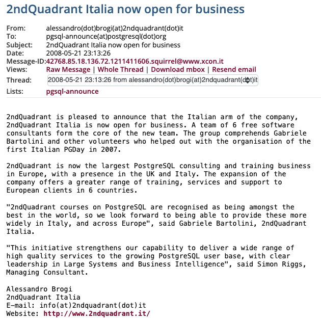

_Sixteen years ago, on May 21, 2008, we proudly announced the opening of the
Italian branch of 2ndQuadrant, marking a milestone in PostgreSQL consulting and
training in Europe. Simon Riggs, the visionary founder of 2ndQuadrant, placed
immense trust in our small team from Prato, Tuscany. Tragically, Simon passed
away on March 26, 2024, leaving a profound void. This article is my small
tribute to Simon, his extraordinary leadership, and his invaluable
contributions to the PostgreSQL community. It reflects on our journey, the
challenges we faced, and the innovative spirit Simon instilled in us. Despite
his passing, Simon's legacy lives on through the values, principles, and
examples he set, continuing to inspire and guide us._

<!--more-->

---

Sixteen years ago today, on May 21, 2008, marked a very special day for me.
It’s the day [we announced to the world the opening of the Italian branch of 2ndQuadrant](https://www.postgresql.org/message-id/42768.85.18.136.72.1211411606.squirrel%40www.xcon.it),
declaring it *“the largest PostgreSQL consulting and training business in
Europe”*.
I fondly call it “2ndQuadrant Italy Day.”

Simon Riggs, the founder of 2ndQuadrant, placed a great deal of trust in our
group of six from Prato, a city in northern Tuscany. Sadly, almost two months
ago, on March 26, 2024, [Simon passed away prematurely](https://www.postgresql.org/about/news/remembering-simon-riggs-2830/),
leaving a profound void.

Writing this article now finally gives me the opportunity to remember him,
something I had wished to do earlier but lacked the energy and courage to
accomplish.

I had the pleasure of meeting Simon for the first time in July 2007 during the
first PostgreSQL Day we organised in Prato. This event, the first significant
Postgres conference in Europe, brought together around 250 people from all over
the world. One of the main goals of that event was to
[lay the foundation for a formal non-profit organisation to promote Postgres in Europe](https://www.postgresql.org/message-id/ad9af2080703020527v37ab5facpde3b2eda07cf358b%40mail.gmail.com),
which eventually became [PostgreSQL Europe](https://www.postgresql.eu/) in 2009
(I’m proud to be one of the founders).

We anticipated that Postgres would grow in popularity, but we never imagined it
would become as widespread as it is today. We knew we were creating something
extraordinary, and our passion drove us. I'm confident that many of the people
who shared that time with me, regardless of where they work now, feel the same
way.

Simon not only envisioned all of this but also spearheaded the movement
globally with his ideas and contributions. His visionary leadership played a
pivotal role in shaping PostgreSQL for enterprise use.

Simon’s first official contribution in 2004, titled “[XLOG file archiving and point-in-time recovery](https://github.com/postgres/postgres/commit/66ec2db72840e4e400d879578744420c969ed7bf)”,
was included in PostgreSQL 8.0 in January 2005. He refined this feature for
version 8.1 and then made significant contributions to the Warm Standby
functionality, the first attempt to provide High Availability in PostgreSQL,
which was released at the end of 2006 in PostgreSQL 8.2. As a result,
PostgreSQL began to challenge the proprietary database management systems
dominating the enterprise market.

I held Simon in the highest regard within the Postgres community, so you can
imagine my excitement after [my first public exchange with Simon in March 2007](https://www.postgresql.org/message-id/1173091447.3760.1811.camel%40silverbirch.site),
followed by private conversations in which he agreed to sponsor our event (he
was working for EnterpriseDB at the time). Then came PGDay Italy in July, and
by December, we began discussing a potential collaboration. Simon had just left
EnterpriseDB and proposed that we become the first partners of 2ndQuadrant. We
agreed, and 16 years ago, our joint venture began. Simon took Gianni Ciolli and
me under his wing, teaching us a great deal. Most importantly, he believed in
us and provided numerous opportunities.

During one of his first trips to Prato, I vividly remember Simon giving us a
copy of Covey’s book “[7 Habits of Highly Effective People](https://www.amazon.com/7-Habits-Highly-Effective-People/dp/1416502491)”,
from which the name 2ndQuadrant originates. The second quadrant represents
tasks that are not urgent but important. From that moment, it was more than
just a name; it shaped who we were. Our commitment to quality excellence became
a cornerstone of our work, driven by our customer-oriented approach.

When I started tackling the challenges that 2ndQuadrant's global customers
presented, I realised how little I actually knew about Postgres, despite
thinking I was proficient. Simon was not only a visionary leader who led by
example but also an exceptional mentor — a quality I later discovered is unique
to true servant leaders. It was a privilege to be part of the team that
[contributed to Hot Standby](https://github.com/postgres/postgres/commit/efc16ea520679d713d98a2c7bf1453c4ff7b91ec)
in that first year.

Over the years, Simon continued to shape the future of PostgreSQL with hundreds
of commits, reviews, performance improvements, and groundbreaking features such
as streaming replication, synchronous replication, and logical replication, to
name a few. There's no doubt in my mind: without Simon, Postgres would not hold
its esteemed status as the most popular database today — and no one can
convince me otherwise.

2ndQuadrant grew organically for the following decade, without any external
capital — something Simon proudly mentioned often — focusing on people more
than hierarchy or processes. By the time EDB acquired us at the end of 2020, we
had grown to over 110 people worldwide.

Since that fateful day in March when Simon passed away, my mind has been
overwhelmed with countless thoughts, leaving me feeling lost and prompting a
reevaluation of life, accompanied by a strong urge to take a break from work
(which my company EDB kindly supported).
However, reflecting on Simon's approach to life and the example he set has been
incredibly comforting. Attending his funeral on April 30 in Luton, where I had
the opportunity to spend some time with the family and meet again many
2ndQuadranters from around the world, infused me with strength, energy, and a
sense of hope for the future.

Simon's passion for life, people, nature, science, tech, and software is a
constant reminder of the power of open-source and its communities in driving
innovation. He not only showed us how to build a thriving open-source business
but also emphasised the importance of taking a holistic approach. While
financial success is crucial, Simon always prioritised the long-term prosperity
of the entire PostgreSQL ecosystem. This ecosystem, which includes the
community, related projects (like Barman for example), competing companies,
and, most importantly, people, is a testament to the collaborative spirit of
open-source innovation. [His last public speech](https://www.youtube.com/watch?v=8W-J36IxYv4),
where he shared his visionary outlook for PostgreSQL's future over the next two
decades in December 2023, perfectly encapsulates this spirit.

In an era dominated by artificial intelligence, I feel compelled to shift the
spotlight back onto human relationships. The mutual trust and respect that
Simon and I shared from the moment we met laid a sturdy foundation that enabled
us to achieve remarkable feats together. Often, a simple glance or handshake
sufficed, devoid of unnecessary bureaucracy. Trust served as the bedrock upon
which we could freely express diverse opinions, engage in spirited debates, and
ultimately reach the constructive dissent necessary for innovation.

On a more personal level, many times he fostered in me the belief that I could
achieve things I had scarcely dared to imagine even starting. This was just one
of his many gifts. I have countless examples of this, but I will name the just
two that mean the most to me:

- When he asked me to lead 2ndQuadrant’s global 24/7 support and organise it on
  a follow-the-sun basis in 2016, with a 15-minute response time and hotfix
  distribution.
- When he asked me to devise 2ndQuadrant’s cloud-native initiative to provide
  services for PostgreSQL on Kubernetes in 2019, which later evolved into the
  CloudNativePG project during my time at EDB. *(The last time I spoke to him in
  February, he was immensely proud of CloudNativePG and its impact on the
  Kubernetes community regarding PostgreSQL adoption.)*

Simon was always there for me, offering advice and support through both good
and tough times. While it's difficult to accept that he won't be there anymore,
I find solace in the fact that he has left an indelible mark on many of us at
2ndQuadrant and in the PostgreSQL community—a legacy of values, principles, and
examples to carry forward. Although the 2ndQuadrant company that opened the
branch in Italy 16 years ago no longer exists, I believe its spirit keeps
living on in the hearts of those who had the privilege to work with Simon.
Now, the responsibility falls on us to honour him through our actions.

Ciao, my friend, thank you for everything!
