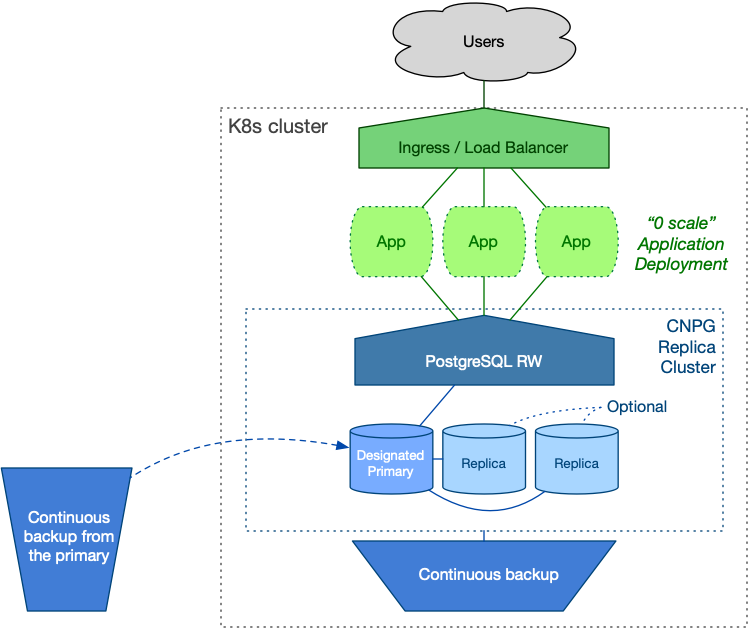
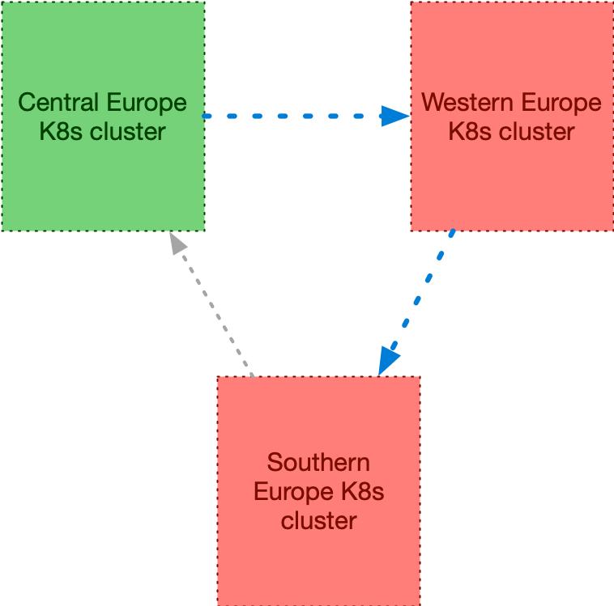

_The upcoming CloudNativePG 1.24 introduces a game-changing feature: the ability
to declaratively manage PostgreSQL cluster switchover across cloud regions or
different Kubernetes clusters. This advancement enables the seamless demotion
of a primary cluster and the promotion of a replica cluster in another region
without the need to re-clone the former primary. This innovation significantly
revolutionises database management practices, enhancing efficiency and
reliability in multi-region and multi-cluster environments._

_CloudNativePG, traditionally confined to single Kubernetes clusters, is now
expanded its functionality to support distributed PostgreSQL topologies across
multiple regions. This enhancement leverages declarative configurations to
manage coordinated promotions, ensuring a single primary instance at any time.
Based on PostgreSQL's primary/standby architecture, this setup is designed to
maintain operational continuity and cater to various deployment scenarios,
including hybrid and multi-cloud environments. The new capabilities
significantly improve high availability and disaster recovery by mitigating the
risks associated with single points of failure in PostgreSQL deployments within
Kubernetes._

<!--more-->

---

Among the exciting updates in the upcoming CloudNativePG 1.24 release, one
groundbreaking feature stands out: the **ability to declaratively control the
switchover of PostgreSQL clusters across different regions** — or, more precisely,
different Kubernetes clusters. This feature enables the demotion of a primary
cluster and the promotion of a replica cluster without the need to re-clone the
former primary, streamlining and enhancing the efficiency of database
management practices.

While CloudNativePG traditionally operates within a single Kubernetes cluster,
we've expanded its capabilities to define a distributed topology for PostgreSQL
clusters spanning multiple regions through declarative configuration. This
distributed setup adheres to PostgreSQL's primary/standby architecture,
allowing for only one primary at any given time while offering versatility
across various deployment scenarios.

This enhancement facilitates hybrid and multi-cloud deployments of PostgreSQL
databases using a fully standard and open-source stack.

Building on existing features for high availability (HA) and disaster recovery
(DR), CloudNativePG mitigates the risk of a single point of failure (SPoF) when
running PostgreSQL databases in Kubernetes.

For a deeper understanding and to consolidate these concepts, I recommend
watching the [video of the talk I delivered in March 2024 at Data on Kubernetes Day in Paris](https://www.youtube.com/watch?v=jeEBzLmRzwY&list=PLHgdNuGxrJt1eqQeSHJ4J-RydHO6-LTeW&index=4&ab_channel=CNCF%5BCloudNativeComputingFoundation%5D).
In this presentation, I delve into these topics and discuss the architectural
foundations supported by CloudNativePG. I also explore the concept of making
the world our single point of failure with PostgreSQL in Kubernetes, providing
insights on how to easily achieve outstanding results in terms of Recovery Time
Objective (RTO) and Recovery Point Objective (RPO) — fundamental goals of any
business continuity solution.

Let's now explore how these capabilities function in practice.

## Real-World Scenario

Rather than presenting a hypothetical distributed cluster spanning three
continents, let's explore a real use case in the banking sector within a single
continent: Europe. Once you grasp the basic concepts, it will be easy to expand
them to cover multiple regions, which I will demonstrate before concluding.

Imagine your organisation operates two Kubernetes clusters—one located in
Central Europe and the other in Western Europe. These regions were chosen
because they are neither too close nor too distant from each other, though
their specific locations are not relevant to this discussion.
Likewise, whether these clusters are private, public, hybrid, or multi-cloud
does not matter here.

Each Kubernetes cluster spans three availability zones (common in public
clouds, less so on-premises), and the PostgreSQL cluster follows a
shared-nothing architecture (refer to ["Recommended Architectures for PostgreSQL in Kubernetes"](https://www.cncf.io/blog/2023/09/29/recommended-architectures-for-postgresql-in-kubernetes/)
for further insights).

As part of the organisation's business continuity plan, the primary data centre
alternates its role between central and Western Europe every 3 to 6 months.
This primary data centre, also known as the active centre, hosts
customer-facing applications and is crucial for ensuring seamless operations.

The counterpart data centre, often referred to as the Disaster Recovery (DR) or
passive Kubernetes cluster, remains on standby.


This process is known as a **controlled switchover**, or planned switchover, of
a data centre.

## Understanding the Primary Data Centre

Within the primary Kubernetes cluster, stateless customer-facing applications
operate seamlessly. These applications interact with a local PostgreSQL cluster
managed by CloudNativePG, which consists of a primary node and two hot-standby
replicas, ensuring high availability (HA). One of these replicas supports
synchronous replication, bolstered by continuous backup mechanisms and WAL
files stored in a nearby object store. We call it the **primary cluster**.

End users access these applications via efficient DNS routing, facilitated by
Kubernetes `Deployment` resources and accessible through either an `Ingress`
resource or a `LoadBalancer` service type. This setup guarantees robust and
reliable user interactions within the system.


While your architecture may include additional components such as caching
layers, this article focuses primarily on PostgreSQL and its direct interfacing
components.

## The Disaster Recovery Data Centre

The Disaster Recovery (DR) data centre is designed to mirror the primary
centre, adhering to a "symmetric" arrangement.

The objective is to ensure seamless service continuity for users during a
switch to the DR centre, ideally with minimal downtime. Leveraging cloud
computing capabilities allows for scaling resources dynamically. For instance,
stateless application workloads can be scaled down to zero during idle periods,
as depicted in the diagram below. Alternatively, the DR centre can handle
read-only applications.

On the PostgreSQL side, you have the flexibility to start with a single
instance or deploy a full cluster with two replicas, mirroring the setup in the
primary data centre. The decision depends on cost optimisation policies and
operational requirements. Ahead of planned switchovers, scaling up to two
replicas is feasible.

CloudNativePG introduces the concept of a
[**replica cluster**](https://cloudnative-pg.io/documentation/current/replica_cluster/).
These are PostgreSQL clusters in continuous recovery mode, with one replica
elected as the *designated primary* ready to assume the primary role if
necessary. Other replicas remain synchronised through PostgreSQL's native
cascading streaming replication from this designated primary.

The designated primary stays synchronised with the source data centre (the
primary) through continuous backup storage. It's crucial that each PostgreSQL
cluster can access the other's object store in read-only mode. This setup
typically provides a 5-minute Recovery Point Objective (RPO) out of the box,
without requiring a continuous streaming connection between the clusters.

---

**There's more...**
_To achieve a lower RPO, it's recommended to establish a secure channel between
the data centres and implement asynchronous streaming replication in addition
to continuous backups. However, a detailed exploration of this topic is beyond
the scope of this article._

---

Following the symmetric architecture, a replica cluster manages its own
continuous backup object store directly through CloudNativePG.

The setup is illustrated in the diagram below.



## Initial setup

### The Data Centre in Central Europe

Let's explore the primary data centre scenario situated in Central Europe,
focusing on the PostgreSQL cluster configuration.

To illustrate, let's define the `pg16-eu-central` primary PostgreSQL cluster
using the `Cluster` resource provided by CloudNativePG:

```yaml
apiVersion: postgresql.cnpg.io/v1
kind: Cluster
metadata:
  name: pg16-eu-central
spec:
  imageCatalogRef:
    apiGroup: postgresql.cnpg.io
    kind: ImageCatalog
    name: postgresql
    major: 16

  instances: 3
  minSyncReplicas: 1
  maxSyncReplicas: 1

  storage:
    size: 100Gi
  walStorage:
    size: 50Gi

  # Local backup object store
  backup:
    barmanObjectStore:
      destinationPath: s3://pg16-eu-central/
      # ...

  # Distributed topology configuration
  externalClusters:
    - name: pg16-eu-central
      barmanObjectStore:
        destinationPath: s3://pg16-eu-central/
        # ...
    - name: pg16-eu-western
      barmanObjectStore:
        destinationPath: s3://pg16-eu-western/
        # ...
  replica:
    primary: pg16-eu-central
    source: pg16-eu-western
```

We use the new [image catalog](https://cloudnative-pg.io/documentation/current/image_catalog/)
feature to specify PostgreSQL 16. Subsequently, we configure three instances
with synchronous replication quorum, ensuring continuous data consistency (RPO
= 0).

We segregate `PGDATA` from WAL files using distinct volumes and integrate a
local object store for continuous backups via Barman Cloud.

---

**IMPORTANT**  
_This setup is intentionally simplified, recognising that
configurations may vary across environments and object store technologies.
However, it's crucial to note that each Kubernetes cluster (Central and
Western Europe) operates independently, adhering to the principle of
shared-nothing architecture._

---

Next, we focus on defining the distributed topology of the PostgreSQL cluster.
We start by declaring the external clusters section, emphasising the importance
of defining your database's distributed topology within your
infrastructure-as-code configuration for long-term clarity and maintainability.

I recommend declaring an identical `externalClusters` section in all `Cluster`
resources participating in a distributed topology. This approach offers a clear
understanding of the entire topology at a glance. Specifically, any cluster
mentioned in the `replica` section (such as `primary`, `source`, or `self`)
must be defined in the `externalClusters` section.

The `replica.primary` directive instructs CloudNativePG to designate this
`Cluster` as the primary within a distributed topology that includes the
Western Europe counterpart. When the cluster's `metadata.name` matches
`replica.primary`, CloudNativePG identifies this cluster as the primary.
Specifically, the match is made against `replica.self` if it is defined,
otherwise, it falls back to `metadata.name`.

The `replica.source` option outlines the topology when this cluster is no
longer the primary, designating the western cluster as the replication
source. In our example, we specify how `pg16-eu-central` can connect to
`pg16-eu-western` when it acts as a replica, using a `barmanObjectStore`
for base backups and WAL archives.

---

**There's more...**  
_You can also use `connectionParameters` to establish a
streaming replication connection to the other PostgreSQL server, specifying
authentication methods such as TLS certificates or passwords. However, a
detailed discussion of this topic is beyond the scope of this article._

---

As a best practice, consider [scheduling your backups](https://cloudnative-pg.io/documentation/current/backup/#scheduled-backups)
and immediately initiating one to expedite replica setup in the Western Europe
data centre. For instance, a daily backup can be scheduled as follows:

```yaml
apiVersion: postgresql.cnpg.io/v1
kind: ScheduledBackup
metadata:
  name: pg16-eu-central-backup
spec:
  schedule: '0 0 0 * * *'
  backupOwnerReference: self
  cluster:
    name: pg16-eu-central
  immediate: true
```

The `immediate` option ensures a full backup is taken immediately upon
instantiating the `ScheduledBackup` object.

In summary, this configuration ensures a secure PostgreSQL cluster with robust
backup mechanisms, leveraging WAL archiving and daily backups. CloudNativePG
provides high availability through hot standby replicas and automated failover
within the Kubernetes environment.

### The Data Centre in Western Europe

Let's move to the DR data centre located in Western Europe, by defining
the `pg16-eu-western` replica cluster using the `Cluster` resource provided by
CloudNativePG, abiding by the principle of symmetry:

```yaml
apiVersion: postgresql.cnpg.io/v1
kind: Cluster
metadata:
  name: pg16-eu-western
spec:
  imageCatalogRef:
    apiGroup: postgresql.cnpg.io
    kind: ImageCatalog
    name: postgresql
    major: 16

  instances: 3
  minSyncReplicas: 1
  maxSyncReplicas: 1

  storage:
    size: 100Gi
  walStorage:
    size: 50Gi

  # Local backup object store
  backup:
    barmanObjectStore:
      destinationPath: s3://pg16-eu-western/
      # ...

  # Distributed topology configuration
  externalClusters:
    - name: pg16-eu-central
      barmanObjectStore:
        destinationPath: s3://pg16-eu-central/
        # ...
    - name: pg16-eu-western
      barmanObjectStore:
        destinationPath: s3://pg16-eu-western/
        # ...
  replica:
    primary: pg16-eu-central
    source: pg16-eu-central
```
You will notice that most of the configuration file is identical, with only a
few unique and defining options:

- The name of the cluster
- The details for the local backup object store
- The source of the replication (Central Europe)

Since `replica.primary` does not match the cluster's name, CloudNativePG treats
it as a replica cluster and uses `replica.source` to determine from which
external cluster to expect transactional changes via physical replication—in
this case, through the WAL archive in the Central Europe object store
(simplified as `s3://pg16-eu-central/`).

In this configuration, applications write to the Central Europe cluster, and
changes to PostgreSQL are continuously recorded in the local WAL (Write-Ahead
Log) file. The WAL file is closed either when it reaches its maximum capacity
or every five minutes. Subsequently, it is archived in the Central Europe
object store and regularly accessed by the designated primary in the replica
cluster using the WAL restore command. This robust capability, known as WAL
shipping, has been a foundational feature of PostgreSQL for over 20 years—a
testament to the contributions of my dear and dearly missed friend,
[Simon Riggs]().

One of the highlights of this architecture is that after the designated primary
replays the WAL file, it is archived in the Western Europe data centre. This
setup inherently provides PostgreSQL continuous backup across two different
regions, regardless of the underlying storage solution.

Let's imagine this setup has been in production for several months. Now, the
organisation needs to execute a controlled switchover to the other data centre
as part of its business continuity plan.

It's time to see the controlled switchover in action.

## Demotion of the Primary Cluster

Since there can only be one primary data centre at a time, the current primary
must be demoted before its role is passed to another data centre during a
controlled switchover.

Thanks to CloudNativePG's integration with PostgreSQL, this operation is now
straightforward.

To initiate the demotion, simply update the `replica.primary` field in the
`pg16-eu-central` cluster configuration to point to `pg16-eu-western`:

```yaml
replica:
  primary: pg16-eu-western
  source: pg16-eu-western
```

When this change is applied, CloudNativePG understands that the
`pg16-eu-central` cluster is no longer the primary and demotes it to a replica
cluster, awaiting changes from its new source, the `pg16-eu-western` cluster
(which remains a replica).

As is typical with PostgreSQL, this operation involves downtime for write
operations since there is no primary across the entire distributed cluster.

During the transition from primary to replica cluster, CloudNativePG performs
two critical operations:

1. Archives the checkpoint REDO WAL file, which includes the shutdown
   checkpoint, as a `.partial` file in the WAL archive.
2. Generates a `demotionToken` in the `Cluster` status. This token is a
   base64-encoded JSON structure retrieved from `pg_controldata`, containing
   essential information such as the database system identifier, latest
   checkpoint's `TimeLineID`, latest checkpoint's REDO location, latest
   checkpoint's REDO WAL file, and the time of the latest checkpoint.

The designated primary in Central Europe is now eagerly awaiting a new WAL file
from the WAL archive of `pg16-eu-western`. However, as previously mentioned,
`pg16-eu-western` is currently still a replica and cannot yet produce a new WAL
file.

Let's explore how we can resolve this catch-22 situation.

## Promotion of the Replica Cluster

Now, it's time to promote the replica cluster in Western Europe, but it must be
done correctly: we require the demotion token from the former primary cluster.

Connect to the Central Europe Kubernetes cluster and retrieve the
`demotionToken` from `pg16-eu-central` with:

```sh
kubectl get cluster pg16-eu-central \
  -o jsonpath='{.status.demotionToken}'
```

If you're curious, you can inspect the content using the following command:

```sh
kubectl get cluster pg16-eu-central \
  -o jsonpath='{.status.demotionToken}' | base64 -d | jq
```

Next, update the `pg16-eu-western` cluster configuration as follows:

```yaml
replica:
  primary: pg16-eu-western
  source: pg16-eu-central
  promotionToken: <DEMOTION_TOKEN_VALUE>
```

The changes to the `primary` and `promotionToken` fields must be made
simultaneously. **Caution:** omitting the promotion token will trigger a failover,
requiring a rebuild of the former primary.

Upon receiving these changes, CloudNativePG initiates a smooth promotion of the
replica cluster to a primary cluster. Initially, CloudNativePG waits for the
designated primary to replicate all WAL information until reaching the
specified LSN (contained in the token). Once this point is reached, the
promotion process begins. The new primary switches timelines, archives the
history file and new WAL in the archive, thereby unblocking the replication
process in the Central Europe cluster (now operating as a replica).

> Et voilà, les jeux sont faits!

## Additional Topics

The example presented in this blog article covers only a subset of the
potential scenarios enabled by this powerful capability. Explaining this
capability is complex, so my goal was to illustrate it with a simple yet
realistic scenario.

Now that you understand how it functions, you can expand upon it by adding a
third Kubernetes cluster and introducing a circular topology. For instance,
consider adding `pg16-eu-south` into the mix:



A conceptual definition of the `externalClusters` section across all three
clusters might resemble this example (with identical configuration in each):

```yaml
externalClusters:
  - name: pg16-eu-central
    barmanObjectStore:
      destinationPath: s3://pg16-eu-central/
      # ...
  - name: pg16-eu-western
    barmanObjectStore:
      destinationPath: s3://pg16-eu-western/
      # ...
  - name: pg16-eu-south
    barmanObjectStore:
      destinationPath: s3://pg16-eu-south/
      # ...
```

The `replica.source` field would then be configured as follows:

- `pg16-eu-south` for `pg16-eu-central`
- `pg16-eu-central` for `pg16-eu-west`
- `pg16-eu-west` for `pg16-eu-south`

Remember, you can enhance this setup by configuring streaming replication in
the external cluster definitions, allowing PostgreSQL to rely on both streaming
and WAL archive channels for enhanced resilience.

Moreover, if you wish, you can expand this topology by incorporating additional
clusters outside of Europe.

## Conclusions

CloudNativePG represents a significant advancement as the first tool capable of
achieving a controlled switchover across data centres entirely through
declarative methods, leveraging the WAL archive alone. This process can be
streamlined into three key steps:

1. Update the configuration of the primary cluster to demote it and designate a
   new primary in the distributed topology.
2. Retrieve the demotion token from the status of the demoted cluster.
3. Update the configuration of the replica cluster to promote it, specifying
   the promotion token.

These operations seamlessly integrate into GitOps and Infrastructure as Code
(IaC) practices, ensuring consistency and reliability in managing PostgreSQL
clusters.

Looking ahead, I anticipate Kubernetes cluster management tools will
incorporate native support for CloudNativePG's controlled switchover
capabilities across clusters, enhancing their operational capabilities.

This innovative approach to defining distributed PostgreSQL cluster topologies
ensures robust adoption in Kubernetes environments. It offers a sustainable
deployment solution not only for public and private clouds but also for hybrid
and multi-cloud scenarios, leveraging Kubernetes and PostgreSQL's standardised
foundational layers. It is up to you to define your single point of failure:
the storage, the data centre, the region, the continent, and, why not, the
world!

In my next blog article, I will continue this topic by providing a repeatable
example on AWS EKS. In the meantime, you can test the feature using the
[latest snapshot of CloudNativePG](https://cloudnative-pg.io/documentation/current/installation_upgrade/#testing-the-latest-development-snapshot)
with [my playground for AWS EKS](https://github.com/gbartolini/postgres-kubernetes-playground/tree/main/aws-eks).
Stay tuned for the next release of CloudNativePG, and don't miss the
opportunity to participate in the release candidate program for version 1.24.0!

---

_On a personal note, I've envisioned adding this feature to CloudNativePG for
quite some time, and I'm thrilled that it's finally a reality. This capability
is a culmination of our extensive multi-year experience in running PostgreSQL
infrastructure and assisting customers worldwide in managing their large-scale
databases. I eagerly await feedback from users worldwide. I extend my heartfelt
thanks to my colleagues at EDB — particularly Armando, Francesco, Leonardo, and
Marco (in alphabetical order) — who developed this feature with dedication and
expertise._
