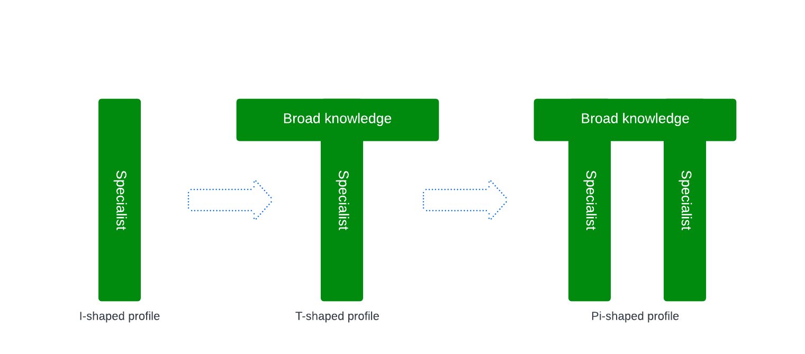
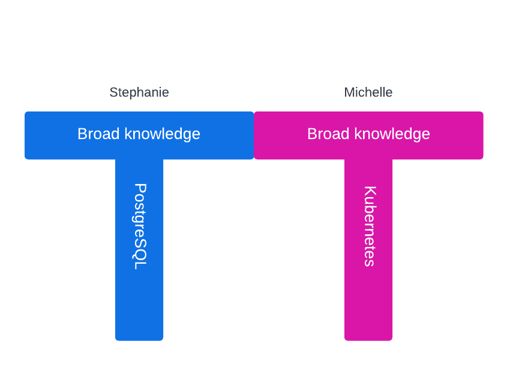

_As Kubernetes celebrates its tenth anniversary, the integration of PostgreSQL
within this ecosystem is gaining momentum, offering challenges and
opportunities, rather than threats, for database administrators (DBAs). This
article explores the evolution of running PostgreSQL in Kubernetes, emphasising
the importance of transitioning from traditional deployment methods to a
cloud-native approach. It discusses the need for DBAs to expand their skills
beyond the traditional scope, advocating for a "T-shaped" or even "comb-shaped"
professional profile. By understanding key Kubernetes concepts and embracing
the principles of “slowification”, simplification, and amplification, DBAs can
effectively collaborate with developers and infrastructure teams. This approach
enhances individual expertise and contributes to the broader adoption and
optimisation of PostgreSQL in Kubernetes environments. The article highlights
the critical role of community and shared knowledge in breaking down silos and
fostering a collaborative culture, which is essential for the successful
deployment and management of PostgreSQL in modern cloud-native
infrastructures._

<!--more-->

---

Kubernetes just turned ten years old and shows no signs of slowing down. I am
incredibly fortunate that my life and career have thrived alongside three major
open-source technologies over the past three decades: Linux, PostgreSQL, and
Kubernetes. Among these, PostgreSQL is my favourite. Since 2019, I have
embraced a significant and, for many, risky change: running PostgreSQL in
Kubernetes.

However, this risk was short-lived; within a few months, my team and I
[scientifically recognised the immense potential of running PostgreSQL on bare metal Kubernetes with local storage](https://www.enterprisedb.com/blog/local-persistent-volumes-and-postgresql-usage-kubernetes).
Since then, it has been a rewarding journey to witness the growing adoption of
PostgreSQL in Kubernetes, driven by our open-source CloudNativePG operator, the
Data on Kubernetes Community, the CNCF, and, last but not least, my company,
EDB. In a recent article, I offered my opinion on the
[current state of PostgreSQL databases in Kubernetes](https://www.gabrielebartolini.it/articles/2024/06/kubernetes-just-turned-ten-where-does-postgresql-stand/),
why the adoption is increasing, and what needs to be done now after 5 years
(August 2019) from the beginning of the Cloud Native initiative that led to
CloudNativePG.

Although the community around CloudNativePG is growing, and the concepts we've
been promoting through talks at conferences like KubeCon and blog articles are
gaining acceptance, there is still a long road ahead to make running PostgreSQL
in Kubernetes a standard practice in today’s organisations - kind of a
commodity. This journey is reminiscent of the transition we experienced 20
years ago, moving from PostgreSQL on bare metal to virtual machines.

I like to describe this phase as paradoxical. While a growing user base is
successfully deploying Postgres workloads in Kubernetes, there are still many
deployments, environments, and organisations where improvements can be made.
Decisions are being made now that don't take into account running PostgreSQL in
Kubernetes and that, for budget reasons, might slow down these organisations.

I have looked at this critically, seeking ways to improve the situation. While
staring at my copy of [“The Phoenix Project”](https://itrevolution.com/product/the-phoenix-project/),
I realised that a possible answer was right before me: DevOps. DevOps has been
one of my career's most influential cultural movements and unquestionably my
favourite when complemented by Lean methodologies.

## Breaking the silos

When it comes to Kubernetes and databases, silos still exist. To keep it
simple, I'll focus on some of the most evident issues I've observed involving
development, infrastructure, and DBA teams:

- **Developers:** They write applications to run in containers but often need
  to realise they could leverage Kubernetes and PostgreSQL microservice
  databases, incorporating them into their CI/CD pipelines for more incredible
  velocity and reliability.
- **Infrastructure Teams:** These teams often need to know that databases can
  run in Kubernetes. They prefer to keep databases outside Kubernetes, running
  as a service in the cloud or on virtual machines/bare metal deployments. These
  decisions can significantly impact both developers and DBAs.
- **DBA Teams:** Most DBAs have little influence in decision-making regarding
  Kubernetes adoption. This situation often places them at a critical career
  crossroads: should they adopt Kubernetes, avoid it if possible, or even deny
  it?

Regarding the last point, I want to highlight a delicate issue some DBAs have
confided in me. As a DBA for many years, I still consider myself a DBA.
Depending on your career and life phase, you might need help to learn new
technologies, such as cloud-native and Kubernetes. The way you are introduced
to change can also lead to different reactions: enthusiasm or, in the worst
case, fear. You might fear losing your job, seek comfort in familiar methods,
and convince yourself that TWWADI ("The Way We've Always Done It") is your only
option. Rather than seeing Kubernetes and cloud-native as an opportunity, fear
might lead you to think of it as a threat, triggering job security
countermeasures to defend your space and isolating you even more in your silo —
a choice accentuated if you are at the end of your professional career.

This article provides insights into these categories, focusing on DBAs. The key
to addressing these challenges is to "amplify" the problems, breaking down
silos and fostering collaboration based on a shared body of knowledge coming
from all areas. This approach promotes collaborative problem-solving and drives
more effective and unified solutions.

## More "T" than "I" for IT Problem-Solving

When working in silos, there is often a tendency to develop a vertical set of
technical skills, becoming, for example, an Oracle or PostgreSQL expert while
ignoring the broader context: the applications, operating system, underlying
storage, network, or infrastructure. This siloed approach can also extend to
soft skills, reducing the ability to interact with others and dehumanising
relationships, often relegated to responding to ticketing system issues.

Due to their lack of generalist skills, individuals with highly specialised
skills may need help to work effectively in team-based, collaborative
problem-solving contexts. These skills are essential for bridging conversations
with peers with vertical expertise in other disciplines or technologies. This
scenario describes **I-shaped profiles**, which are often characteristic of
people in the early stages of their careers.

When I-shaped profiles expand their skill sets to include more generalist
abilities, such as soft skills or basic knowledge of different topics, they
become **T-shaped profiles**. Adding another specialisation transforms them
into **Pi-shaped profiles**; with more specialisations, they become
**Comb-shaped profiles**. These latter profiles are ideal for breaking silos
and thriving in collaborative problem-solving scenarios, provided effective
leadership enables them to work together.

--- 

_To learn more on I-shaped to T-shaped profiles,
[read this article](https://www.soonersaferhappier.com/post/pop-the-bubbles-creating-a-learning-ecosystem)._

--- 

## Teamwork and The Social Circuitry

As knowledge workers, problem-solving is complex, often delayed and impacted by
miscommunication and misunderstanding. This is why a single-person initiative
rarely drives innovation and successful IT projects.

Typically, these complex problems are solved by organisations, teams within an
organisation, or even communities (think of open-source projects) through
**teamwork**.

However, working in teams is not easy and requires good "coaches" with strong
leadership skills, distinct from project management, authority, or power. These
coaches must coordinate their multidisciplinary team of several members with T,
Pi, or comb-shaped profiles to achieve a shared goal.

In their latest masterpiece, [“Wiring the Winning Organization“](https://itrevolution.com/product/wiring-the-winning-organization/)
Gene Kim and Steven J. Spear describe organisations as **sociotechnical
systems** where people operate on three layers:

1. **Technical Objects**: For DBAs, this includes PostgreSQL databases; for
   infrastructure teams, it might consist of Kubernetes or virtualisation; for
   developers, it encompasses specific programming languages.
2. **Tooling and Instrumentation**: This includes CI/CD pipelines, deployment
   software, observability tools, automated testing, and more.
3. **Social Circuitry**: This layer includes the _"overlay of processes, norms,
   and routines, the means by which individual efforts are expressed and
   integrated through collaboration toward a common purpose."_

While the first two layers cover a sociotechnical system's "technical" aspects,
the third layer is responsible for the social component. Social circuitry is a
deliberately vague term that perfectly describes the challenges behind making
an organisation or a team succeed and requires continuous observation,
listening, and adaptation.  Kim and Spear describe three mechanisms to move
from the Danger Zone (failure) to the Winning Zone (success):

- **Slowification**: move problem-solving in a controlled, psychologically safe,
  repeatable and testable environment, rather than being in the unforgiving
  front line of the production system
- **Simplification**: take advantage of slowification to decompose more significant
  and complex problems into a series of smaller ones so to address them one at
  a time, incrementally, or via modularisation
- **Amplification**: make problems surface and, via the social circuitry, foster
  slowification and simplification that are required to iteratively solve them,
  through feedback and improvement loops.

When applied to our specific case of improving running Postgres databases in
Kubernetes, this article aims to amplify the problems discussed at the start,
initiate slowification and simplification, break the silos and deliver
high-performing deployments.

A key starting point is acknowledging that increasing PostgreSQL databases will
be running in Kubernetes each year.  DBAs can play a crucial role in shaping
the future of PostgreSQL in this environment. By mastering enough Kubernetes to
manage PostgreSQL effectively, DBAs can drive the processes of simplification
and optimization, enabling them to have meaningful conversations within their
organisations and the broader communities. This approach not only enhances
their skill set but also positions them as vital contributors to the evolution
of PostgreSQL in the cloud-native landscape. The diagram below shows how
T-shaped profiles enable Stephanie, our subject matter expert (SME) for
PostgreSQL, to work with Michelle, our SME for Kubernetes, and build value for
our organisation.

--- 

_To learn more on slowification, semplification and amplification,
[read this article](https://itrevolution.com/articles/the-three-mechanisms-to-wire-the-winning-organization/)._

--- 

## Learn Enough Kubernetes to Make a "T"

If you're running PostgreSQL directly on bare metal or VMs, consider your
familiarity with Linux. Most PostgreSQL DBAs know just enough Linux to handle
day-to-day operations effectively. Similarly, you don’t need to become a
Kubernetes expert but acquire enough knowledge to manage day-to-day operations
(and possibly day-zero planning for architecture, storage, etc.). This approach
transforms your deep expertise (“I” shape) into a broader skill set (“T”
shape).

Kubernetes can be complex and overwhelming, but mastering its essentials will
enable you to integrate PostgreSQL effectively with the rest of your
infrastructure.

### Understanding Kubernetes Basics

Kubernetes manages infrastructure and applications as code, supporting
resilience, high availability, and self-healing. The goal of a Kubernetes
cluster is to ensure the cluster itself becomes the single point of failure.
Typically, this translates to:

- Making an entire region the SPOF in public cloud deployments, where a
  Kubernetes cluster spans at least three availability zones (data centres).
- Making a single data centre the SPOF in on-premises deployments, where a
  Kubernetes cluster resides within one data centre.

The first crucial concept to grasp is that availability zones can automate high
availability for Kubernetes applications, including PostgreSQL databases, at a
regional level.

### Nodes and Workloads

A level below availability zones are the worker nodes, where applications run.
These nodes, running Kubernetes (often on Linux), can be on virtual machines or
bare metal. For PostgreSQL, dedicating some machines to PostgreSQL workloads is
advisable. Kubernetes offers several ways to manage this separation logically
through configuration (node labels, taints, affinity/anti-affinity rules). You
can even dedicate a bare metal server to a single PostgreSQL instance, using
Kubernetes for declarative control.

The second key concept is that worker nodes are where applications, including
PostgreSQL, run. You don’t need to set up the nodes yourself, but you should
understand how Kubernetes schedules workloads.

### Networking and Services

Nodes and availability zones are connected by a shared network. Kubernetes
provides a `Service` resource that abstracts connectivity, allowing
applications to point to a PostgreSQL primary service without worrying about
which instance is accepting write operations. This abstraction holds even
during failovers or controlled switchovers.

The third key concept is understanding Kubernetes services.

### Storage Management

Storage is crucial for PostgreSQL DBAs and applies equally in Kubernetes.
Although CloudNativePG is storage agnostic, performance can vary based on
storage choice. Kubernetes uses `StorageClass` to provision storage
dynamically. Vendors provide storage classes that create persistent volumes
with standard interfaces, thanks to the Container Storage Interface (CSI)
initiative.

The fourth key concept is understanding how storage classes, persistent
volumes, persistent volume claims, and CSI drivers work together.

For more on network and storage with CloudNativePG, see my
[CNPG recipe #9](https://www.gabrielebartolini.it/articles/2024/07/cloudnativepg-recipe-9-inspecting-the-network-and-the-storage-in-a-cloudnativepg-cluster/).

### Deployments and Operators

Applications in Kubernetes are typically deployed with a `Deployment` resource,
which supports redundancy, self-healing, scaling, and rolling updates. However,
stateful applications like PostgreSQL require an operator for effective
management. CloudNativePG is designed to manage PostgreSQL in Kubernetes.

The fifth key concept is getting familiar with CloudNativePG. Start with the
documentation and follow the quickstart guide or my
[CNPG recipe #1](https://www.gabrielebartolini.it/articles/2024/03/cloudnativepg-recipe-1-setting-up-your-local-playground-in-minutes/).
You just need Docker on your laptop and Kubernetes running in a container using
`kind`.

### Building Kubernetes Expertise

Finally, consider training to build your Kubernetes expertise.
I recommend Mumshad Mannambeth’s self-paced course,
["Certified Kubernetes Administrator (CKA) with Practice Tests"](https://www.udemy.com/course/certified-kubernetes-administrator-with-practice-tests/).
Dedicate an hour a day for 45 days to this class, and you'll become a Certified
Kubernetes Administrator, equipping you to run PostgreSQL in Kubernetes
confidently.

By embracing these concepts and resources, you’ll be well-equipped to manage
PostgreSQL in Kubernetes, enhancing your skill set and contributing
meaningfully to your organisation and the broader community.

## Conclusions

The transition to running PostgreSQL on Kubernetes presents both challenges and
exciting opportunities for database administrators (DBAs). To navigate this
complex landscape, it's crucial to become familiar with the interfaces and
systems surrounding PostgreSQL. This includes understanding the Kubernetes
ecosystem, networking, storage solutions, and the broader infrastructure. Such
comprehensive knowledge enables DBAs to optimise performance, make informed
decisions, and effectively troubleshoot issues.

For those who already have a passion for PostgreSQL, adopting Kubernetes offers
a powerful orchestration platform that enhances scalability, availability, and
manageability. Your expertise is critical as the adoption of PostgreSQL in
Kubernetes grows, and your skills are essential in this evolving environment.
The synergy between PostgreSQL and Kubernetes provides a unique opportunity for
innovation, making your role increasingly significant.

To effectively address the challenges of this transition, it is valuable to
adopt the concepts of slowification, simplification, and amplification, as
discussed by Kim and Spears and mentioned earlier. These principles are crucial
for breaking down silos within organisations and fostering a collaborative
environment where DBAs, developers, and infrastructure teams work together. By
becoming a "T-shaped" professional with deep expertise in PostgreSQL and a
broad understanding of related technologies, you can effectively contribute to
this collaborative problem-solving approach. Moreover, expanding further into a
"comb-shaped" profile by acquiring multiple areas of expertise enhances your
ability to engage with diverse teams and drive innovation.

In conclusion, mastering PostgreSQL on Kubernetes is not just a technical
challenge but also a cultural shift. By embracing the principles of
slowification, simplification, and amplification, and by broadening your skill
set, you can become a pivotal contributor to your organisation and the broader
PostgreSQL community.

This comprehensive approach will enhance your career prospects and play a vital
role in successfully integrating and optimising PostgreSQL within the
Kubernetes landscape.

---

Stay tuned for the upcoming recipes! For the latest updates, consider
subscribing to my [LinkedIn](https://www.linkedin.com/in/gbartolini/) and
[Twitter](https://twitter.com/_GBartolini_) channels.

If you found this article informative, feel free to share it within your
network on social media using the provided links below. Your support is
immensely appreciated!

_Cover Picture: [“Big, bigger, huge“](https://www.flickr.com/photos/rainbirder/6448212231)._

