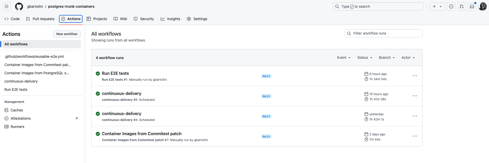
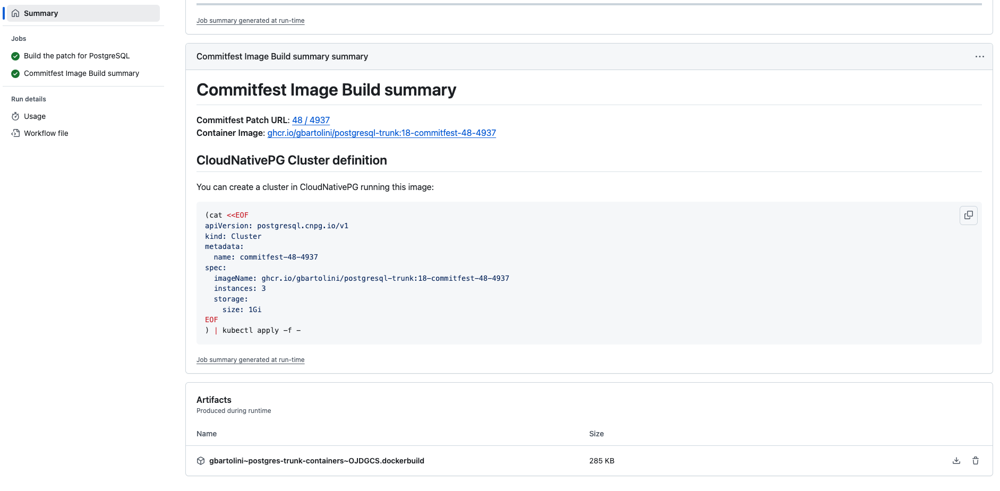

_In this article, I’ll explore how Kubernetes and CloudNativePG can be
leveraged to streamline the testing of PostgreSQL patches, especially during a
Commitfest. By automating the creation of PostgreSQL container images from any
public Git repository, developers and reviewers can quickly and efficiently
test patches within a Kubernetes environment. This approach not only saves time
but also enhances the reliability of patches before integration into the main
codebase._

<!--more-->

---

If you're involved in developing PostgreSQL 18 and have some extra time,
consider testing patches using Kubernetes with CloudNativePG. With just a few
minutes of setup, you can leverage GitHub to fork a repository and build a
container image directly from any public Git repo containing PostgreSQL
sources. This allows you to harness the full power of Kubernetes to rigorously
test and validate your PostgreSQL patches, ensuring they meet the highest
standards before integration.


## Background

Traditionally, testing a PostgreSQL patch involves compiling it from source on
your local machine. However, this approach doesn't translate well to a
Kubernetes environment due to container immutability requirements, which ensure
enhanced security. Typically, you would need to build the image on your laptop,
load it into a local registry, and then test it with Kind. While effective,
this method is often time-consuming, cumbersome, and demotivating.
I learned this the hard way when
[testing a patch that disables `ALTER SYSTEM`](https://www.postgresql.org/message-id/flat/CABeG9LuK3jRJv82XPjDTAvs99YrMqZnB6d_uZBk_cs2SO-jtBA%40mail.gmail.com#32c796666a7e2186d3a96f8bccca283f),
and I vowed never to go through such a manual process again.


## The “Postgres Patch Tester” Project

Determined to streamline this workflow, I explored ways to improve it. During a
conversation with my colleague Peter Eisentraut, a PostgreSQL core team member
at EDB, he introduced me to an intriguing project: the [“Postgres Patch Tester”](http://cfbot.cputube.org/).
This tool is invaluable, as its associated [Git repository](https://github.com/postgresql-cfbot/postgresql)
contains branches automatically generated from patches submitted to the
PostgreSQL hackers mailing list and registered on the [Commitfest portal](https://commitfest.postgresql.org).

Each branch follows a specific format: `commitfest/<COMMITFEST_ID><PATCH_ID>`.
Here, `COMMITFEST_ID` corresponds to the Commitfest session number (e.g., `49`
for [September 2024](https://commitfest.postgresql.org/49/)), and `PATCH_ID`
identifies the individual patch (e.g., `4937` for the patch titled
[“Identify huge pages accessibility using madvise”](https://commitfest.postgresql.org/49/4937/)).


## Expanding the “Postgres Trunk Containers” Project

Why is this important? At CloudNativePG, we maintain a Git repository called
[postgres-trunk-containers](https://github.com/cloudnative-pg/postgres-trunk-containers),
which automatically builds a daily snapshot container image of the latest
PostgreSQL trunk (i.e., the `master` branch) and uses it to run our
comprehensive end-to-end (E2E) test suite. To clarify, the code currently on
the trunk will become part of PostgreSQL 18 when it is released next year. This
proactive approach allows us to quickly identify and address breaking changes,
regressions, or other issues, ensuring that both CloudNativePG and PostgreSQL
continue to evolve seamlessly.

Thanks to the collaborative efforts of my colleagues, Niccolò Fei and Jonathan
Gonzalez, we've expanded the project's scope to empower anyone with a GitHub
account to build their own Postgres container images from source. This now
includes support for a generic and publicly accessible Git repository
containing PostgreSQL source code, allowing even Commitfest patches to be
easily tested through the  "Postgres Patch Tester" project.


## Building Your First PostgreSQL Image from Source

At CloudNativePG we've streamlined the process of building PostgreSQL container
images with a fast and efficient GitHub action. You’re no longer restricted to
the PostgreSQL trunk; you can now target any Git repository, branch, or
specific Commitfest patch and have a PostgreSQL image ready to run with
CloudNativePG within minutes. This setup facilitates quick and seamless patch
testing in a Kubernetes cluster, including local environments using Kind.

To get started, [fork the cloudnative-pg/postgres-trunk-containers](https://github.com/cloudnative-pg/postgres-trunk-containers/fork)
repository.


Once you've done it, navigate to your forked repository's “Actions” tab.

In the left panel, under “Actions,” select “Container Images from Commitfest
Patch.” Next, click the “Run workflow” dropdown and fill out the form by
specifying the Commitfest ID and the patch ID (you can leave the branch and
PostgreSQL version fields empty). Finally, click the “Run workflow” button to
begin building the container image based on the specified patch.

You can monitor the progress directly within the “Actions” GitHub interface;
the process should take just a few minutes. Once the workflow is complete, the
“Actions” page will look similar to this:



Click on the “Container Images from Commitfest Patch” job and scroll down to
the bottom of the page. You should see an output similar to the screenshot
below:



As shown, the workflow successfully built and published the image
“ghcr.io/gbartolini/postgresql-trunk:18-commitfest-48-4937” in my GitHub
“postgresql-trunk” container registry. Additionally, the action provides a
basic set of instructions that we’ll use in the next section for testing this
image in a 3-instance CloudNativePG cluster.

You can access all the images produced, including those from daily workflows
that test the PostgreSQL trunk, via the “Packages” interface in your forked
repository.

## Testing the Patch with CloudNativePG in Kind

If you're familiar with CloudNativePG, you may have already created a cluster
and started testing the patch in a Kubernetes environment. If not, don’t
worry—you can use Kind (Kubernetes in Docker) right on your laptop, as
explained in this section. I recommend going through [CNPG Recipe #1]()
to understand the basics and prerequisites. Once you're ready, follow the steps
below to proceed.

First, create a basic Kind cluster with the following command:

```sh
kind create cluster
```

Next, deploy the latest non-production snapshot of the CloudNativePG operator:

```sh
curl -sSfL \
  https://raw.githubusercontent.com/cloudnative-pg/artifacts/main/manifests/operator-manifest.yaml | \
  kubectl apply --server-side -f -
```

Wait for the controller manager to start. Then, as the final step, create the
`Cluster` resource using the command provided in the action’s summary:

```sh
(cat <<EOF
apiVersion: postgresql.cnpg.io/v1
kind: Cluster
metadata:
  name: commitfest-48-4937
spec:
  imageName: ghcr.io/gbartolini/postgresql-trunk:18-commitfest-48-4937
  instances: 3
  storage:
    size: 1Gi
EOF
) | kubectl apply -f -
```

Within a few minutes, you’ll have a 3-instance PostgreSQL cluster running in
your local environment. To connect via `psql` using `postgres` peer
authentication on the primary instance, use:

```sh
kubectl exec -ti commitfest-48-4937-1 -c postgres -- psql
```

If you want to access a shell to inspect the pod where PostgreSQL is running,
type:

```sh
kubectl exec -ti commitfest-48-4937-1 -c postgres -- bash
```

## There’s more …

The Commitfest patch action is just one feature available. Another helpful
action allows you to effortlessly create a PostgreSQL image from the patch
you're working on or reviewing: simply point to the branch containing the patch
in any publicly accessible Git repository. With the “Container Images from
PostgreSQL Sources” action, you can easily specify your Git repository and the
relevant branch.

In just a few minutes, your custom image will be ready to deploy with
CloudNativePG.

After building the container image, you can use the same repository to run
end-to-end (E2E) tests, ensuring your patch is fully validated and
production-ready. The "Run E2E tests" action allows you to specify the Postgres
image to deploy within disposable CloudNativePG clusters, which are created as
part of the E2E test suite. This comprehensive suite of tests—one of the most
thorough for a PostgreSQL cluster (not just an instance)—takes just under 2
hours to complete.

## Conclusions

Leveraging Kubernetes and CloudNativePG for testing can significantly
streamline the validation process of PostgreSQL patches, particularly those
submitted during a Commitfest. This approach not only saves time and effort but
also enhances the reliability of patches before they are integrated into the
main codebase.

By automating the creation and testing of PostgreSQL images, we aim to free
developers from the complexities of manual testing, allowing them to focus more
on creativity and innovation. Each patch will benefit from approximately 200
automated tests running on a 3-instance PostgreSQL cluster within Kubernetes
rather than on a single instance. These tests cover critical areas such as
backup, recovery, automated failover, switchover, monitoring, logging,
upgrades, and more.

I hope this initiative proves valuable and is well-received by the PostgreSQL
developer community. Additionally, I hope it encourages more developers to
explore Kubernetes and Cloud Native technologies, helping us all stay at the
forefront of database innovation.

I would greatly appreciate your feedback! Thank you!

---

Stay tuned for the upcoming recipes! For the latest updates, consider
subscribing to my [LinkedIn](https://www.linkedin.com/in/gbartolini/) and
[Twitter](https://twitter.com/_GBartolini_) channels.

If you found this article informative, feel free to share it within your
network on social media using the provided links below. Your support is
immensely appreciated!

_Cover Picture: [“Elephant Trunk“](https://flic.kr/p/fqAYN6)._

