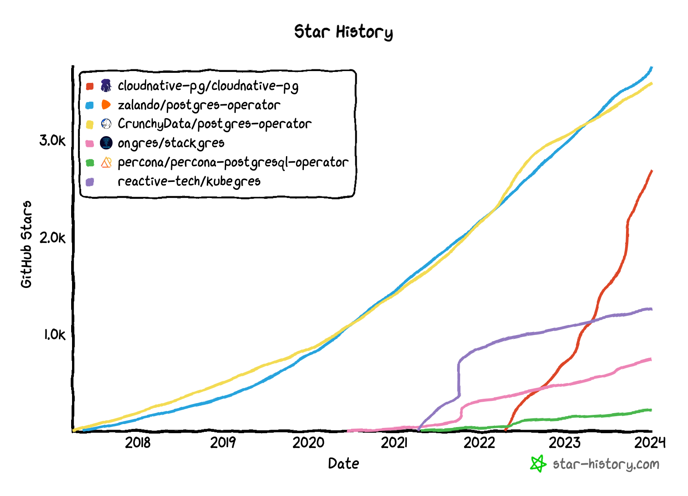
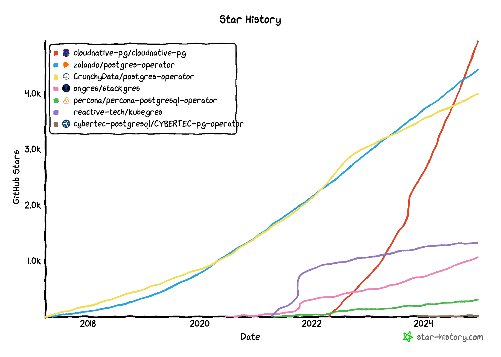

_2024 was a transformative year for CloudNativePG, marked by significant
contributions to the Kubernetes ecosystem, increased adoption, and a growing
community. This article reflects on key milestones, including the integration
of advanced Kubernetes features, conference highlights, and personal insights,
while looking ahead to the opportunities awaiting PostgreSQL in the
cloud-native era._

<!--more-->

---

When Kubernetes debuted a decade ago, I could never have predicted that it
would become such an integral part of my professional journey. While I only
began working with Kubernetes in August 2019, it quickly became clear to me
that it was the future of running PostgreSQL. By the end of that year, we had
our prototype operator, and, together with my fantastic team, we made a pivotal
decision: I would never go back to using virtual machines to run PostgreSQL.
That decision has shaped my work ever since.

Fast-forward to 2024, which marked my fifth year of running PostgreSQL on
Kubernetes and a transformative period for CloudNativePG. Open-sourced in May
2022, CloudNativePG has grown into one of the leading solutions for running
PostgreSQL in Kubernetes. It stands out as the only operator governed by a
vendor-neutral, openly governed community designed to be truly
Kubernetes-native.

Let’s take a closer look at the milestones we achieved this year.

## Popularity

The rising popularity of CloudNativePG is best exemplified by the growing
[number of stars on its GitHub repository](https://star-history.com/#cloudnative-pg/cloudnative-pg&zalando/postgres-operator&CrunchyData/postgres-operator&ongres/stackgres&percona/percona-postgresql-operator&reactive-tech/kubegres&Date)
—a clear and transparent measure of community support.

This organic growth highlights the trust and enthusiasm of its users, achieved
without reliance on artificial marketing boosts from either the CloudNativePG
Community or EDB. As the primary creator and supporting organisation of
CloudNativePG, EDB has played a pivotal role in its success.  With a
long-standing reputation as a leader in PostgreSQL development, EDB continues
to drive innovation and collaboration within the broader open-source ecosystem,
bridging the gap between Postgres and Kubernetes and ensuring the project's
sustained growth and relevance.

A snapshot taken on January 10, 2024, shows that CloudNativePG was the third
most popular PostgreSQL operator, with roughly 2.7k stars. At the time,
Crunchy’s PGO had around 3.6k stars (900 more), and the Zalando operator led
with nearly 3.8k stars (1.1k ahead).

However, significant milestones were reached later in the year. In July,
CloudNativePG surpassed Crunchy’s PGO to claim the second spot, and by
September, it overtook Zalando to become the most popular operator. Today,
CloudNativePG has nearly 5k stars, outpacing Zalando with 4.4k and Crunchy’s
PGO with 4k.

In 2024 alone, CloudNativePG achieved an impressive milestone, gaining 2.3k
stars on GitHub—an average of over six stars per day. This far outpaced its
peers, with Zalando adding 700 stars (+1.6k total) and Crunchy gaining 400
(+1.9k total). The remarkable momentum has captured widespread attention,
including a colourful endorsement from Percona’s founder, Peter Zaitsev.
Speaking at Data on Kubernetes Day during KubeCon North America in Salt Lake
City last November, Zaitsev remarked:

> [CloudNativePG is kicking everybody’s a**e!](https://www.youtube.com/watch?v=6sZqbNwzZag&t=1288s&ab_channel=CNCF%5BCloudNativeComputingFoundation%5D)

## Releases

In 2024, we followed a robust release cadence, delivering updates across nine
release windows:

- **February 2**: 1.22.1, 1.21.3, and 1.20.6
- **March 14**: 1.22.2 and 1.21.4
- **April 24**: [1.23.0 (minor release)](https://cloudnative-pg.io/releases/cloudnative-pg-1-23.0-released/), 1.22.3, and 1.21.5
- **April 29**: 1.23.1
- **June 12**: 1.23.2, 1.22.4, and 1.21.6
- **July 29**: 1.23.3 and 1.22.5
- **August 22**: [1.24.0 (minor release)](https://cloudnative-pg.io/releases/cloudnative-pg-1-24.0-released/) and 1.23.4
- **October 16**: 1.24.1 and 1.23.5
- **December 23**: [1.25.0 (minor release)](https://cloudnative-pg.io/releases/cloudnative-pg-1-25.0-released/), 1.24.2, and 1.23.6

With the release of version 1.23, we made a significant strategic decision to
streamline our [support policy](https://cloudnative-pg.io/documentation/current/supported_releases/#support-policy).

As a community, we now only support the latest minor version of CloudNativePG
and extend support for the second-last minor version for an additional three
months. This change has dramatically simplified our codebase management,
reducing the need for extensive backports and the complexity of automated test
combinations in our continuous delivery pipelines.

Another pivotal improvement was the introduction of release candidates,
prompted by a retrospective analysis of the misstep in version 1.23.0 — which
required a swift 1.23.1 patch just five days later. The new release candidate
process has allowed us to provide our user base with [preview versions](https://cloudnative-pg.io/documentation/current/preview_version/)
of upcoming releases, such as 1.24 and 1.25, fostering better feedback and
stability.

In 2023, CloudNativePG followed a similar pattern, delivering four minor
releases (1.22, 1.21, 1.20, and 1.19) across eight release windows. Looking
ahead to 2025, we aim to streamline this cadence further by targeting one minor
release per quarter, ensuring a more predictable and consistent release
schedule.

## Features

The three minor releases in 2024 brought several exciting new features and
enhancements to CloudNativePG.

My favourite is the declarative support for distributed topologies of
PostgreSQL databases across multiple Kubernetes clusters. This feature enables
hybrid and multi-cloud deployments through native physical replication using
Infrastructure as Code (IaC). I detail this in my blog article,
[“Making the World My Single Point of Failure with PostgreSQL,”]()
and it can be easily explored using the
[CNPG Playground]().

The second is the new API for synchronous replication control, which provides
unprecedented opportunities to balance data durability and self-healing. It
also enables complete configuration of PostgreSQL’s `synchronous_standby_names`
option. For more details, check out
[“CNPG Recipe 16 - Balancing Data Durability and Self-Healing with Synchronous Replication”syncrep]()
and
[“CNPG Recipe 13 - Configuring PostgreSQL Synchronous Replication.”]().

The third is the first hooks implementation for [CNPG-I](https://github.com/cloudnative-pg/cnpg-i/),
the CloudNativePG Interface. This framework enables third parties to extend the
CloudNativePG operator through plugins, eliminating the need to modify the core
codebase—similar to how Kubernetes and PostgreSQL operate.

Finally, we significantly enhanced support for native logical replication,
making it easier than ever to migrate to CloudNativePG from any PostgreSQL 10+
instance, including DBaaS solutions like RDS. CloudNativePG 1.25 introduces
support for declarative logical replication subscriptions and publications.
This technology also facilitates online major upgrades of PostgreSQL with
near-zero cutover time. Read [“CNPG Recipe 15 - PostgreSQL Major Online Upgrades with Logical Replication”]()
and
[“CNPG Recipe 5 - How to Migrate Your PostgreSQL Database in Kubernetes with Near-Zero Downtime from Anywhere”]()
for more information.

## Ecosystem Evolution

CloudNativePG is evolving around its main project, the CloudNativePG operator,
into a comprehensive ecosystem for running PostgreSQL in Kubernetes. The
recently introduced CNPG-I framework will amplify this transformation in the
future.

In 2024, we made an important change to the project’s governance by introducing
the concept of components and, most notably, component owners. While
maintainers oversee the entire project, component owners are maintainers of
specific sub-projects. Key components include container images, Helm charts,
Grafana dashboards, OLM, and the website.

Two standout components introduced this year are:

- **[CNPG Playground](https://github.com/cloudnative-pg/cnpg-playground)**: A
  local learning environment designed to experiment with CloudNativePG,
  leveraging Docker and Kind to simplify onboarding and exploration.
- **[Barman Cloud Plugin](https://github.com/cloudnative-pg/plugin-barman-cloud)
  for Backup and Recovery on Object Stores**: This marks our first plugin for
  the CNPG-I framework and is poised to eventually replace the in-core support
  for Barman Cloud, aligning with our modular vision.

## Kubernetes development

2024 marked a milestone year for our project as one of our developers made a
significant contribution to Kubernetes:
[Leonardo Cecchi](https://www.linkedin.com/in/leonardo-cecchi-54b0a396/),
co-founder and maintainer of CloudNativePG, played a pivotal role as a
[key contributor](https://github.com/kubernetes-csi/external-snapshotter/blob/v8.2.0/CHANGELOG/CHANGELOG-8.2.md)
to the development of
[VolumeGroupSnapshot support in Kubernetes 1.32](https://kubernetes.io/blog/2024/12/11/kubernetes-v1-32-release/#volume-group-snapshot).
This feature lays a critical foundation for future backup and recovery
operations for PostgreSQL databases using volume snapshotting within Kubernetes
environments.

This achievement highlights the holistic approach our team at EDB takes in
integrating Postgres and Kubernetes, combining technical innovation with
community-driven collaboration.

## Conference Talks

This year, I was privileged to present at several significant events in the
cloud-native and PostgreSQL communities.

### KubeCon & CloudNative Highlights

At KubeCon Europe in Paris (March), I delivered two sessions:

- **["From Zero to Hero: Scaling Postgres in Kubernetes Using the Power of CloudNativePG"](https://colocatedeventseu2024.sched.com/event/1YFha/from-zero-to-hero-scaling-postgres-in-kubernetes-using-the-power-of-cloudnativepg-gabriele-bartolini-edb)**
  at the [Data on Kubernetes](https://dok.community/) co-located event.
- **["Scaling Heights: Mastering Postgres Database Vertical Scalability with Kubernetes Storage Magic"](https://kccnceu2024.sched.com/event/1YeM4/scaling-heights-mastering-postgres-database-vertical-scalability-with-kubernetes-storage-magic-gabriele-bartolini-edb-gari-singh-google)**,
  co-presented with the brilliant [Gari Singh from Google Cloud](https://www.linkedin.com/in/garisingh/).

In November, I travelled to Salt Lake City for KubeCon North America,
participating in a panel discussion on
[the future of DBaaS on Kubernetes](https://sched.co/1i7kL)
alongside industry experts Melissa Logan (Constantia and [Data on Kubernetes Community - DoK](https://dok.community/)),
Sergey Pronin (Percona), and Deepthi Sigireddi (PlanetScale).

Earlier that week, at Cloud Native Rejekts,
[Leonardo Cecchi](https://www.linkedin.com/in/leonardo-cecchi-54b0a396/)
and I co-presented
["Maximising Microservice Databases with Kubernetes, Postgres, and CloudNativePG"](https://cfp.cloud-native.rejekts.io/cloud-native-rejekts-na-salt-lake-city-2024/talk/38Z8MB/),
which you can watch [here](https://www.youtube.com/watch?v=uBzl_stoxoc).

Capping off a busy November, I was honoured to speak at the **Kubernetes
Community Days Denmark** in Copenhagen. My talk,
["CloudNativePG: The Past, The Present, The Future"](https://kcddenmark.dk/schedule/),
provided a comprehensive overview of the project's evolution and vision. You
can watch the recording [here](https://www.youtube.com/watch?v=_R0dxSHlJoY&ab_channel=CloudNativeNordics).

### PostgreSQL Conferences

In addition to cloud-native events, I spoke at two PostgreSQL conferences:

- **Swiss PGDay 2024** in Rapperswil (June 28):
  ["Unleashing the Power of PostgreSQL in Kubernetes"](https://www.pgday.ch/2024/#schedule).
* **PostgreSQL Conference Europe 2024** in Athens (October 24):
  ["Postgres: From Cloud to Hybrid and On-Prem Again"](https://www.postgresql.eu/events/pgconfeu2024/schedule/session/6056-postgres-from-cloud-to-hybrid-and-on-prem-again/).

Athens provided a particularly inspiring glimpse into the evolving perception
of Kubernetes within the PostgreSQL community. Adam Wright’s session,
["Demystifying Kubernetes for Postgres DBAs: A Guide to Operators"](https://www.postgresql.eu/events/pgconfeu2024/schedule/session/5584-demystifying-kubernetes-for-postgres-dbas-a-guide-to-operators/),
drew a packed audience, demonstrating growing interest among Postgres
professionals.

Another standout talk was David Pech’s
["From VMs to Cloud-Native PostgreSQL in Kubernetes: A Case Study of Migrating a Medium-Sized Application"](https://www.postgresql.eu/events/pgconfeu2024/schedule/session/5829-from-vms-to-cloud-native-postgresql-in-kubernetes-a-case-study-of-migrating-a-medium-sized-application/).
Despite being scheduled concurrently with Robert Haas’ session on incremental
backups in PostgreSQL 17, Pech's talk highlighted practical insights into
cloud-native adoption—a key theme resonating throughout the conference.

## Articles

On February 28, 2024, I launched my blog at [gabrielebartolini.it](http://gabrielebartolini.it),
dedicated to running PostgreSQL on Kubernetes with CloudNativePG. The response
surpassed my most optimistic expectations: in just 10 months, I published 25
articles, attracting tens of thousands of visits, according to Google
Analytics.

Here are some of the most popular posts:

1. **[CNPG Recipe 5 - How to migrate your PostgreSQL database in Kubernetes with ~0 downtime from anywhere]()**
2. **[CNPG Recipe 1 - Setting up your local playground in minutes]()**
3. **[Maximizing Microservice Databases with Kubernetes, Postgres, and CloudNativePG]()**
4. **[CNPG Recipe 4 - Connecting to Your PostgreSQL Cluster with pgAdmin4]()**
5. **[Kubernetes Just Turned Ten: Where Does PostgreSQL Stand?]()**

I also want to spotlight an insightful article by Shaun Thomas, a former
colleague at 2ndQuadrant and EDB, a friend and one of the foremost experts in
PostgreSQL High Availability. In his piece,
["Kubernetes Killed the High Availability Star"](https://bonesmoses.org/2024/pg-phriday-kubernetes-killed-the-high-availability-star/),
Shaun draws on years of experience deploying enterprise-level PostgreSQL in
bare metal and VM environments. He makes a compelling case for why Kubernetes
is now the go-to platform for high-availability PostgreSQL deployments.

Shaun’s article perfectly aligns with my ideas in
["The Urge for ‘T-Shaped’ Profiles to Smooth the Challenges of Running Postgres in Kubernetes"]().
In this post, I discuss the vast opportunities for PostgreSQL DBAs to adapt and
thrive in the Kubernetes era. Thank you, Shaun, for reinforcing this message!

## Application to the CNCF Sandbox

In September, [CloudNativePG submitted its second application to the CNCF Sandbox](https://github.com/cncf/sandbox/issues/128),
marking an exciting step forward for the project. We are optimistic that it
will be accepted this time, setting the stage for CloudNativePG to become the
first PostgreSQL database project to embark on the
[CNCF graduation process](https://www.cncf.io/projects/).
If the Sandbox application is approved in January, our next milestone will be
achieving incubation status, further cementing CloudNativePG’s role as a
foundational solution in the cloud-native database ecosystem and advancing the
democratisation of PostgreSQL access.

## Reflections on 2024

On a personal note, 2024 has been a challenging year. In March, I faced the
heartbreaking loss of my friend, mentor, and leader
[Simon Riggs]().
Simon’s untimely passing left an unfillable void but also a lasting legacy for
those of us who had the privilege of growing as PostgreSQL professionals and
human beings under his guidance and example. His unwavering dedication to
making PostgreSQL the best database in the world inspires me every day.

Simon was a staunch advocate for PostgreSQL extensions, and it feels fitting to
mention ongoing efforts in this area. One such initiative is the
``extension_control_path`` patch, being developed for PostgreSQL 18 by Peter
Eisentraut. This improvement will provide a foundation for running immutable,
self-contained container images of PostgreSQL extensions, enabling them to be
loaded at runtime in CloudNativePG. While this effort will hopefully come to
fruition in 2025, it represents an exciting step forward for extension
management and flexibility. David Wheeler from Tembo recapped the status of
this work in his blog post ["RFC: Extension Packaging & Lookup"](https://justatheory.com/2024/11/rfc-extension-packaging-lookup/).

## Looking Ahead

After reflecting on the measurable achievements of the past year, I want to
conclude with a more personal perspective. Having been part of the PostgreSQL
and Kubernetes ecosystem for quite some time, it’s clear to me that something
extraordinary is happening around CloudNativePG. A vibrant, dynamic community
is emerging, and the convergence of PostgreSQL and Kubernetes is opening
unprecedented opportunities for both new and seasoned PostgreSQL users.

As we enter 2025, I’m optimistic about the future. CloudNativePG and the
broader PostgreSQL-on-Kubernetes movement are poised for remarkable growth.
Let’s keep building, innovating, and growing together. **Happy New Year!**

---

Stay tuned for the upcoming recipes! For the latest updates, consider
subscribing to my [LinkedIn](https://www.linkedin.com/in/gbartolini/) and
[Twitter](https://twitter.com/_GBartolini_) channels.

If you found this article informative, feel free to share it within your
network on social media using the provided links below. Your support is
immensely appreciated!

_Cover Picture: [“Herd Of Elephants in African Bush“](https://www.needpix.com/photo/163800/)._

