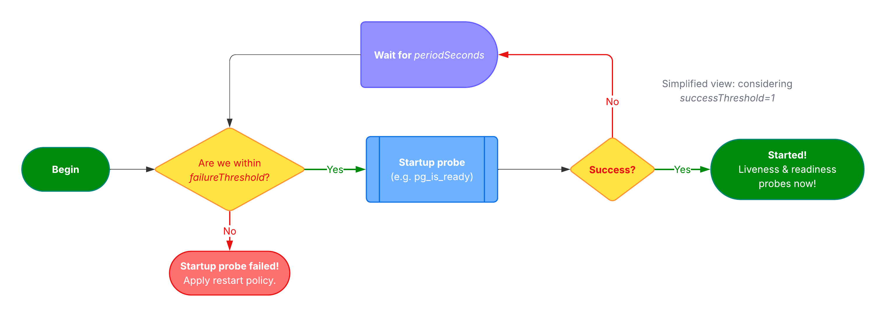

_CloudNativePG 1.26 introduces enhanced support for Kubernetes startup probes,
giving users finer control over how and when PostgreSQL instances are marked as
"started." This article explores the new capabilities, including both basic and
advanced configuration modes, and explains the different probe strategies—such
as `pg_isready`, SQL `query`, and `streaming` for replicas. It provides
practical guidance for improving the reliability of high-availability Postgres
clusters by aligning startup conditions with actual database readiness._

<!--more-->

---

CloudNativePG 1.26 introduces an [enhanced implementation](https://github.com/cloudnative-pg/cloudnative-pg/pull/6623)
of Kubernetes startup and readiness probes for each Postgres pod in a
high-availability cluster—comprising a primary instance and any number of
optional replicas (also known as standby instances). This improvement gives
Kubernetes more accurate insight into when a Postgres instance should be
considered *started* and, more importantly, *ready* to accept connections from
applications or to be promoted following a failover.

In this article, I’ll focus on the new **startup probe**, while deferring
discussion of the updated readiness probe to a future post.

---

## Understanding Startup Probes

[Startup probes](https://kubernetes.io/docs/concepts/configuration/liveness-readiness-startup-probes/#startup-probe),
introduced in Kubernetes 1.20, provide better control over workloads that take
time to initialise—delaying the execution of liveness and readiness probes
until the application is truly up.
If a startup probe fails, Kubernetes will terminate the container and attempt
to restart it.

Before startup probes, the typical workaround was to configure an initial delay
in the readiness probe—an imprecise and often unreliable solution.

Startup probes are as configurable as liveness and readiness probes, using the
same key parameters:

- `failureThreshold` – The number of consecutive failures allowed before the
  container is considered to have failed startup and is restarted.
- `periodSeconds` – How often (in seconds) to perform the probe.
- `successThreshold` – The number of consecutive successes required for the
  probe to be considered successful (typically set to 1).
- `timeoutSeconds` – The number of seconds after which the probe times out if
  no response is received.

These parameters allow for fine-tuned behaviour based on the expected startup
characteristics of your application.

As with other probes, the outcome (success or failure) is determined by
invoking a specific endpoint or command defined in the container's
configuration.

For more details, refer to the official [Kubernetes documentation on
probes](https://kubernetes.io/docs/concepts/workloads/pods/pod-lifecycle/#container-probes).

Rather than reinventing the wheel with custom health checks at the PostgreSQL
layer, CloudNativePG—staying true to its cloud-native principles—builds on
Kubernetes’ native probe framework to manage the health of individual Postgres
instances and the overall cluster. This article, along with the ones that
follow, aims to explain how these probes work and how to make the most of them
in your deployments.

---

## Why Startup Probes Matter for Postgres

Postgres is a prime example of a workload that can require significant time to
start—especially in high-availability setups. Whether it's a primary or a
replica, startup time can vary depending on factors such as crash recovery
or recovery from a restart point, or replication lag to reach a consistent
state. Replicas in particular may take longer to become ready, especially when
replaying WAL segments after a restart.

In the early days of EDB’s Cloud Native Postgres operator (the proprietary
predecessor of CloudNativePG), this behaviour often led to problems: replicas
would fail to become ready within the configured window and be prematurely
restarted by Kubernetes.

With startup probes, CloudNativePG can now give Kubernetes a clearer, more
accurate signal about a pod's initialisation state—reducing unnecessary
restarts and improving cluster stability.

## How CloudNativePG Implements Startup Probes

CloudNativePG offers two modes for configuring startup probes, giving users the
choice between simplicity and fine-grained control:

- **Basic mode** – A simplified configuration that automatically sets key probe
  parameters based on the value of `.spec.startDelay`.
- **Advanced mode** – A fully customisable setup using the
  `.spec.probes.startup` stanza.

By default, CloudNativePG uses `pg_isready` to check whether a PostgreSQL
instance has started successfully (more on this later).

The following diagram provides a simplified flow of the startup probe
lifecycle, illustrating how its parameters interact and how it fits into the
broader context of liveness and readiness probes.



## Basic Mode: Simplicity Through `startDelay`

The default and recommended approach is to use the `startDelay` parameter
defined in the `Cluster` specification. This value is expressed in seconds and
is set to `3600` (1 hour) by default—ensuring sufficient time for even complex
or delayed PostgreSQL startup scenarios, such as replica recovery.

In this mode, CloudNativePG preconfigures the startup probe with the following
values:

- `periodSeconds`: 10 seconds – the probe runs every 10 seconds
- `successThreshold`: 1 – only one successful check is required
- `timeoutSeconds`: 5 seconds – the probe will wait up to 5 seconds for a response

The `failureThreshold` is automatically calculated using the formula:

```
failureThreshold = startDelay / periodSeconds
```

With the default `startDelay` of 3600 seconds and `periodSeconds` of 10, this
results in:

```
failureThreshold = 3600 / 10 = 360
```

This means Kubernetes will wait up to an hour (360 failed probes at 10-second
intervals) before declaring the container as failed and restarting it, in
accordance with the pod’s restart policy (`Always` with CloudNativePG).

The following example creates a PostgreSQL cluster with a `startDelay` value of
**600 seconds** (10 minutes), using the basic startup probe configuration mode:

```yaml

```

Once the cluster has been created, you can inspect the `startupProbe`
configuration applied to the container in the primary pod (`freddie-1`) with
the following command:

```sh
kubectl get pod freddie-1 \
  -o jsonpath='{.spec.containers[*].startupProbe}' | jq
```

The output should be similar to:

```json
{
  "failureThreshold": 60,
  "httpGet": {
    "path": "/startupz",
    "port": 8000,
    "scheme": "HTTPS"
  },
  "periodSeconds": 10,
  "successThreshold": 1,
  "timeoutSeconds": 5
}
```

While this approach is sufficient for most use cases—providing a reliable and
consistent startup window with minimal configuration—**the remainder of this
article focuses on the advanced method for those who require greater control
and customisation**.

## Advanced Mode: Full Probe Customisation

For use cases that require more granular control, CloudNativePG provides the
`.spec.probes.startup` stanza. This allows you to explicitly define all the
startup probe parameters introduced earlier in this article.

The following configuration instructs Kubernetes to:

- Probe the container every 5 seconds (`periodSeconds`)
- Allow up to 120 consecutive failures (`failureThreshold`)—equivalent to 10
  minutes (600 seconds)—before considering the startup probe failed
- Restart the container if it hasn’t successfully started within that time

```yaml

```

This approach is ideal when the default settings are not suitable for your
workload, in particular the `periodSeconds` option.

As you may have noticed, these settings apply uniformly to all PostgreSQL
instance pods—whether they are primaries or standbys. Now, let’s explore what
additional aspects you can customise in your setup to fine-tune behaviour even
further.

## Probe Strategies

By default, CloudNativePG uses PostgreSQL’s
[`pg_isready`](https://www.postgresql.org/docs/current/app-pg-isready.html)
utility to determine whether a PostgreSQL instance—primary or replica—is
accepting connections. If `pg_isready` returns `0`, the probe is considered
successful; any other return code results in a failure.

The strategy can be changed through the `.spec.probes.startup.type` parameter.

### Type: `pg_isready` (default)

This is the default behaviour for both primary and replica pods and requires no
additional configuration.

### Type: `query`

Alternatively, you can configure the probe to execute a basic ping SQL query on
the local `postgres` database (see [`query.go`](https://github.com/cloudnative-pg/cloudnative-pg/blob/main/pkg/management/postgres/webserver/probes/query.go)).

To enable this mode, set `.spec.probes.startup.type` to `query`, as shown in
the following example:

```yaml

```

This approach works for both primaries and replicas and may be preferred in
scenarios where a successful connection isn't enough—you also want to ensure
the instance can respond to a minimal query.

### Type: `streaming` (replica-only)

CloudNativePG also provides a third probe type, `streaming`, specifically
designed for replicas.

```yaml

```

In this example, a replica is considered started only when it is actively
streaming from the primary and its replication lag falls below a defined
threshold. This threshold is controlled via the `maximumLag` parameter, which
specifies the acceptable lag in bytes (in this case it is set to **32MB**—the
equivalent of two WAL segments).

If `maximumLag` is not set, the default behaviour, the replica is marked as
started as soon as it begins streaming from the primary, regardless of its lag.

I strongly recommend considering this probe strategy for production-grade high
availability setups. It ensures that a replica is marked as started not merely
when it accepts connections, but when it is meaningfully synchronised with the
primary—either already attached and streaming, or doing so with minimal lag (as
you require). This leads to a more reliable failover experience and better
application consistency.

## Key Takeaways

Startup probes in Kubernetes are essential for ensuring that PostgreSQL
instances—especially replicas—aren’t prematurely marked as healthy. With
CloudNativePG 1.26, you now have the flexibility to define exactly what
“started” means for your workloads, whether that’s simply accepting
connections, executing a basic query, or actively streaming with minimal lag.

For most production environments, the new `streaming` probe strategy for
replicas is worth adopting. It allows you to delay declaring a replica as
started until it’s actually useful for failover, leading to more robust and
predictable high-availability behaviour.

In short: startup probes are no longer a checkbox—they’re a tuning instrument.
In the next article, I’ll walk you through readiness probes and how they
complement startup probes to ensure your PostgreSQL workloads are both ready
and resilient.

---

Stay tuned for the upcoming recipes! For the latest updates, consider
subscribing to my [LinkedIn](https://www.linkedin.com/in/gbartolini/) and
[Twitter](https://twitter.com/_GBartolini_) channels.

If you found this article informative, feel free to share it within your
network on social media using the provided links below. Your support is
immensely appreciated!

_Cover Picture: [“Baby Sri Lankan Elephant“](https://commons.wikimedia.org/wiki/File:Baby_Sri_Lankan_elephant_%28Elephas_maximus_maximus%29.jpg)._

