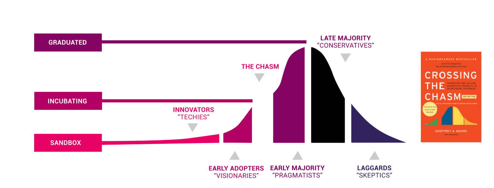
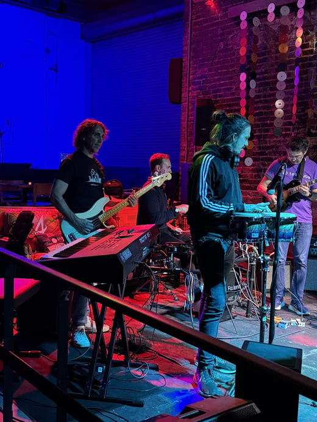

_This blog post recaps my eventful participation in KubeCon + CloudNativeCon
North America 2025 in Atlanta, highlighting the key decision by maintainers to
formally apply for CNCF Incubation for the CloudNativePG operator. I had the
pleasure of delivering three presentations: a CNPG Lightning Talk focused on
community contribution; a deep-dive with Yoshiyuki Tabata on implementing
modern PostgreSQL authorisation using Keycloak and OAuth for robust database
security; and a session with Jeremy Schneider introducing the new quorum-based
consistency feature in CNPG 1.28 for safer cluster reconfigurations. Links to
the videos of all three talks are shared within the full article._

<!--more-->

---

**KubeCon + CloudNativeCon North America** in Atlanta was a huge success,
marking my 9th KubeCon since first attending in San Diego back in 2019
(a streak thankfully re-established after the COVID interruption).
It was an honour for me to represent my company, [EDB](https://www.enterprisedb.com/),
which fully supports our open-source contributions as the highest form of
innovation in technology.

The event was an unparalleled opportunity to connect with numerous
practitioners, professionals, and community members dedicated to the CNCF
ecosystem, as well as CloudNativePG community fellows. I had the pleasure of
speaking three times across the conference agenda this year.

My primary goal for this participation was to go beyond the usual networking
and actively engage with relevant **CNCF TOC** and **TAG members** to gauge the
maturity and placement of **CloudNativePG (CNPG)**.
We wanted to understand if our community-driven operator was truly in the right
spot to apply for [**CNCF Incubation**](https://www.cncf.io/project-metrics/).

I am thrilled to share that all of us maintainers decided to take
the leap right there in Atlanta, submitting our formal application!

You can follow our journey and show your support here:
[CloudNativePG Application for Incubation](https://github.com/cncf/toc/issues/1961).

## Project Lightning Talk: CloudNativePG, Running PostgreSQL the Kubernetes Way

My first engagement was the [Project Lightning Talk](https://kccncna2025.sched.com/event/27d5y/project-lightning-talk-cloudnativepg-running-postgres-the-kubernetes-way-gabriele-bartolini-maintainer)
in the CNCF projects event. This 5-minute slot was a fantastic opportunity to
speak rapidly about **CloudNativePG**. I was pleased to see many attendees in
the audience who not only use **Postgres in Kubernetes** but were already
familiar with **CNPG**.

The main message I conveyed was simple: join our vendor-neutral community!
Contributions are vital, and even a simple act can help immensely—for instance,
adding your **organisation** to the [`ADOPTERS.md` file](https://github.com/cloudnative-pg/cloudnative-pg/blob/main/ADOPTERS.md)
helps us cross the chasm and strengthen our incubation application.

We are a rapidly growing project, and I emphasised the diversity of contribution opportunities:

> CloudNativePG is over 15 projects! You can become a contributor and owner of
> our Helm charts, our Grafana dashboards, our container images, or our
> metrics.

*Watch the recording: [Project Lightning Talk CloudNativePG](https://www.youtube.com/watch%3Fv%3DpYwYwehQX3U)*

-----

## Modern PostgreSQL Authorisation with Keycloak: Cloud Native Identity Meets Database Security

The [second presentation](https://kccncna2025.sched.com/event/27FXv/modern-postgresql-authorization-with-keycloak-cloud-native-identity-meets-database-security-yoshiyuki-tabata-hitachi-ltd-gabriele-bartolini-edb)
was a joint talk with **Yoshiyuki Tabata** of Hitachi, focusing on a critical
security modernisation topic.

The session tackled the obsolescence and inherent security risks of relying on
static credentials (usernames and passwords) for database access in dynamic,
multi-tenant cloud-native environments. We showed how traditional database
authentication methods no longer meet modern security and compliance demands.

We walked the audience through the solution: integrating **PostgreSQL
authorisation with Keycloak**, an Identity and Access Management (IAM)
open-source solution. The core concept is **externalising authentication and
authorisation logic** from the database to enable centralised identity control
across services. We demonstrated how to securely map Keycloak roles and groups
directly to PostgreSQL privileges and enforce fine-grained access policies, all
managed seamlessly in Kubernetes environments using **CloudNativePG**.
We also touched upon how the innovative native OAuth support in PostgreSQL 18
has the potential to fundamentally transform database authentication, not only
in Kubernetes. For those interested in this cutting-edge approach, we also
launched our experimental project, the **Postgres Keycloak OAuth Validator**,
which you can find here:
[cloudnative-pg/postgres-keycloak-oauth-validator](https://github.com/cloudnative-pg/postgres-keycloak-oauth-validator).

*Watch the recording: [Modern PostgreSQL Authorisation With Keycloak](https://www.youtube.com/watch?v=TYgPemq06fg)*

-----

## Quorum-Based Consistency for Cluster Changes with CloudNativePG Operator

My [final talk](https://kccncna2025.sched.com/event/27FfQ/quorum-based-consistency-for-cluster-changes-with-cloudnativepg-operator-jeremy-schneider-geico-tech-gabriele-bartolini-edb),
delivered alongside **Jeremy Schneider** of GEICO Tech, focused on a major new
feature introduced in **CloudNativePG 1.28**: **failover quorum** for cluster
changes.

This talk was originally submitted by **Leonardo Cecchi**, and I had the honour of
stepping in for him last minute after he had to bow out for family reasons. We
explored how the concept of **quorum consistency** can be applied to cluster
reconfigurations in a single-writer database like PostgreSQL.

We demonstrated how the **CNPG operator** uses this theory to maintain safety
and avoid data loss during complex operations. Specifically, we detailed how
this feature provides **quorum-based consistency** for critical stateful
operator actions (like scaling and switchover).

Achieving this requires very careful end-to-end coordination between the
control plane and data plane algorithms—a necessity for achieving **Level V
capabilities** for stateful operators on Kubernetes—ultimately providing
reliable auto-healing under compounded failures or network partitions. We were
pleased to share lessons and insights useful for maintainers of other
Kubernetes operators for stateful workloads.

*Watch the recording: [Quorum-Based Consistency for Cluster Changes with CloudNativePG Operator](https://www.youtube.com/watch?v=iQUOO3-JRK4)*

(There's also a [recording of a longer version of the talk](https://www.youtube.com/watch?v=sRF09UMAlsI), presented by Leonardo and Jeremy on Nov 24, which I highly recommend!)

-----

## Conclusion

**KubeCon NA Atlanta** was a pivotal event for the entire **CloudNativePG**
community. The engagement and positive feedback were overwhelming, and the
decision to officially apply for **CNCF Incubation** with CloudNativePG marked
a true high point.

Another memorable moment was participating in the [KubeJam](https://kubejam.com/)
event organised by [Testkube](https://testkube.io).

Now, we look forward to the next major event in Europe, and I can't wait to see
you all at [KubeCon + CloudNativeCon Europe in Amsterdam](https://events.linuxfoundation.org/kubecon-cloudnativecon-europe/),
hopefully with CloudNativePG proudly holding Incubation status!

---

Stay tuned for the upcoming recipes! For the latest updates, consider
subscribing to my [LinkedIn](https://www.linkedin.com/in/gbartolini/) and
[Twitter](https://twitter.com/_GBartolini_) channels.

If you found this article informative, feel free to share it within your
network on social media using the provided links below. Your support is
immensely appreciated!

<!--
_Cover Picture: [“TITLE“](URL)._
-->

