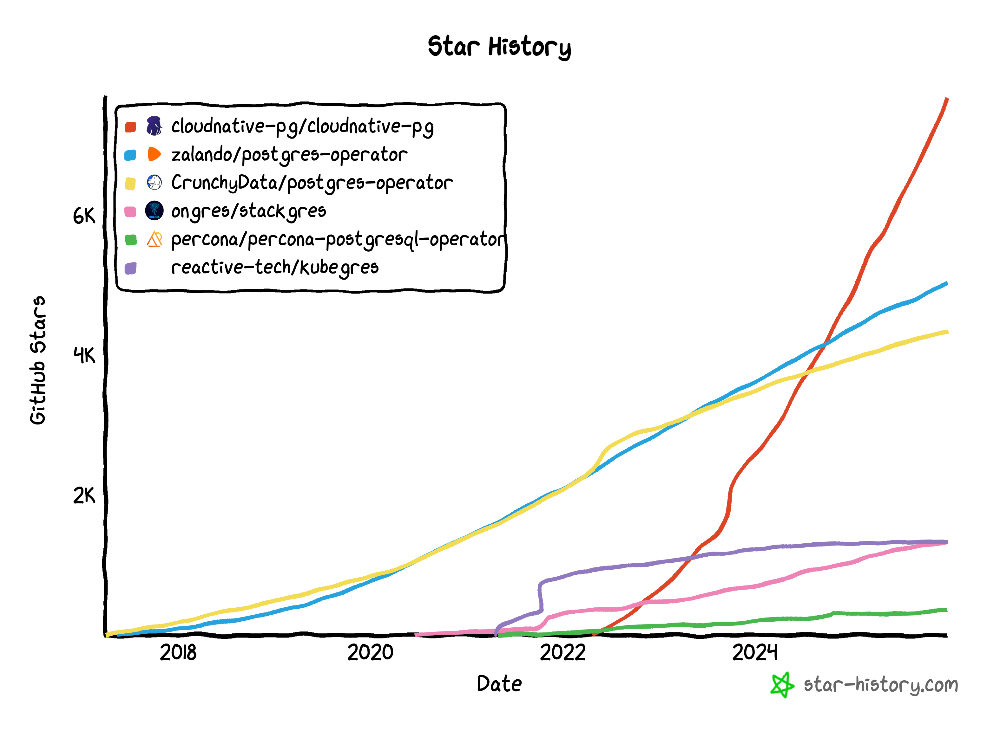

_2025 marked a historic turning point for CloudNativePG, headlined by its
acceptance into the CNCF sandbox and a subsequent application for incubation.
Throughout the year, the project transitioned from a high-performance operator
to a strategic architectural partner within the cloud-native ecosystem,
collaborating with projects like Cilium and Keycloak. Key milestones included
the co-development of the `extension_control_path` feature for PostgreSQL
18, revolutionising extension management via OCI images, and the General
Availability of the Barman Cloud Plugin. With nearly 880 commits (marking five
consecutive years of high-velocity development) and over 132 million downloads,
CloudNativePG has solidified its position as the standard for declarative,
resilient, and sovereign PostgreSQL on Kubernetes._

<!--more-->

---

As 2025 comes to a close, it is time to look back at what has been the most
transformative year for **CloudNativePG** since its inception.
If [2024 was about maturity]()
and the introduction of the plugin interface (CNPG-I), 2025 has been about
community integration, architectural breakthroughs, and setting the stage for
the future of PostgreSQL on Kubernetes.

From joining the CNCF sandbox to co-authoring features for PostgreSQL 18, the
project has evolved from a powerful operator into a cornerstone of the
cloud-native ecosystem.

## The climb through the CNCF landscape

We started the year with a historic achievement. On **15 January 2025**,
CloudNativePG was officially [accepted into the **CNCF Sandbox**](https://github.com/cncf/sandbox/issues/128).
This was a pivotal moment for our community, reinforcing our commitment to
vendor neutrality and open governance.

It is important to note that CloudNativePG is the only PostgreSQL operator
project for Kubernetes that is community-owned and governed under a
transparent, vendor-neutral model.
Unlike other operators that are controlled by single companies, our transition
into the CNCF ensures that the project remains a public good, where the roadmap
is shaped by users and contributors across the entire industry.

Being part of the sandbox has been highly **strategic**, allowing us to
collaborate deeply with other CNCF projects to solve complex architectural
challenges. In 2025, we focused on three key integrations:

- [**Cilium**](https://cloudnative-pg.io/docs/1.28/cncf-projects/cilium):
  Enhancing pod-to-pod security and network policies tailored for database
  traffic.  

- [**External Secrets Operator (ESO)**](https://cloudnative-pg.io/docs/1.28/cncf-projects/external-secrets):
  Standardising how database credentials and certificates are injected and
  rotated.  

- [**Keycloak**](https://github.com/keycloak/keycloak/issues/43258):
  Bridging the gap between database security and modern identity management.

Given this rapid growth, we officially [**applied for CNCF incubation**](https://github.com/cncf/toc/issues/1961)
**on 12 November 2025**. Moving toward the incubating tier reflects our status
as a stable, production-ready technology used by organisations worldwide.

## Uncompromising robustness and high availability

A database operator's primary job is to protect data. In 2025, we addressed
complex edge cases involving network partitions and potential "split-brain"
scenarios.

We [responded to community concerns](https://github.com/cloudnative-pg/cloudnative-pg/discussions/7462)
regarding rare failure modes in environments without synchronous replication by
significantly hardening our HA logic:

- [**Primary isolation check**](https://cloudnative-pg.io/docs/1.28/instance_manager#primary-isolation):
  We introduced a mechanism where a primary node can self-fence if it loses
  connectivity with the rest of the cluster, preventing it from accepting writes
  while a new primary is being elected.  
- [**Failover quorum with synchronous replication**](https://cloudnative-pg.io/docs/1.28/failover/#failover-quorum-quorum-based-failover):
  We promoted to stable a quorum-based mechanism that ensures failover only
  occurs when a majority of nodes agree, providing much higher consistency
  guarantees.  
- [**Improved probe infrastructure**](https://cloudnative-pg.io/docs/1.28/instance_manager):
  We overhauled the startup, readiness, and liveness probes to be more granular.
  This ensures that a node is only considered "ready" when it is truly capable
  of serving traffic safely, reducing the risk of routing errors during volatile
  network conditions.

## Revolutionising extensions: PostgreSQL 18 and extension control path

We also actively participated in the development of a new feature for
**PostgreSQL 18** called `extension_control_path`. This feature allows us to
move away from monolithic custom images:

- **The [`postgres-extensions-containers` project](https://github.com/cloudnative-pg/postgres-extensions-containers):**
  We now build independent, self-contained OCI images for individual
  extensions.  
- [**Dynamic loading**](https://cloudnative-pg.io/docs/1.28/imagevolume_extensions):
  Using the [Kubernetes `VolumeSource` feature](https://github.com/kubernetes/enhancements/issues/4639),
  CloudNativePG can now dynamically mount these extension images at runtime.  
- **Minimal base images:** We’ve moved away from DockerHub to our own
  [`minimal` PostgreSQL images](https://github.com/cloudnative-pg/postgres-containers)
  based on Debian, featuring full **SBOMs**, attestation of provenance, and
  signing.

## Key releases and GA milestones

- [**v1.26 (23 May)**](https://cloudnative-pg.io/releases/cloudnative-pg-1-26.0-released/):
  Focused on declarative power, this release introduced **offline in-place major
  upgrades** and expanded **declarative database management** to include schemas
  and extensions directly in the manifest.  
- [**v1.27 (12 August)**](https://cloudnative-pg.io/releases/cloudnative-pg-1-27.0-released/):
  Introduced **logical decoding slot synchronisation**, essential for HA in CDC
  workloads.  
- [**v1.28 (9 December)**](https://cloudnative-pg.io/releases/cloudnative-pg-1-28.0-released/):
  Promoted **quorum-based failover** to stable and introduced **declarative
  foreign data wrapper (FDW)** support.

We also celebrated the **General Availability (GA) of the [Barman Cloud Plugin](https://github.com/cloudnative-pg/plugin-barman-cloud)**,
standardising backups via the CNPG-I interface.

## Community and knowledge sharing

Our presence at major conferences highlighted the intersection of the
Kubernetes and PostgreSQL communities, including the **first-ever Kubernetes
Summit** at a Postgres conference (**PGConf.eu in Riga**).

Our [**three LFX mentorship projects**](https://github.com/cloudnative-pg/cloudnative-pg/blob/main/contribute/lfx-mentorship-program.md)
also delivered key features like declarative FDW support, a
[chaos testing](https://github.com/cloudnative-pg/chaos-testing)
framework, and a [multi-version documentation framework](https://github.com/cloudnative-pg/docs).

### KubeCon highlights

- **London:** [Consistent volume group snapshots](https://sched.co/1tx8g).  
- **Atlanta:** [Running Postgres the Kubernetes way](https://www.youtube.com/watch?v=pYwYwehQX3U&t=4s),
  [PostgreSQL authorisation with Keycloak](https://www.youtube.com/watch?v=TYgPemq06fg),
  and [Quorum-based consistency](https://www.youtube.com/watch?v=iQUOO3-JRK4).

## 2025 by the numbers

The growth of the project this year has been staggering. We began 2025 with
4,900 GitHub stars and ended the year with over **7,700**, a testament to the
expanding community of users and contributors. Most notably, the global
adoption of the operator has reached a new peak, with the total number of
downloads for the operator image now exceeding **132 million**.

Furthermore, our development velocity remains remarkably consistent: 2025 saw
nearly **880 commits**, marking the **fifth year in a row** that the main
CloudNativePG operator project has exceeded 800 commits per year. This
sustained pace underscores the health and long-term commitment behind the
project.

## Final reflections

2025 was the year CloudNativePG matured from a high-performance operator into a
cornerstone of the CNCF ecosystem. By tackling the toughest problems in HA and
influencing the core of PostgreSQL 18, we are ensuring that Postgres remains
the most reliable database for the cloud-native era.

However, the journey doesn't end here. We still have a long road ahead of us to
reach our full potential. As I often say, citing one of my favourite AC/DC
tracks: [**"It's a long way to the top (if you wanna rock 'n' roll)."**](https://www.youtube.com/watch?v=g-qkY2yj4_A)
We are ready for the climb.

Thank you to every contributor and user who made this year possible. See you in
2026!

---

Stay tuned for the upcoming recipes! For the latest updates, consider
subscribing to my [LinkedIn](https://www.linkedin.com/in/gbartolini/) and
[Twitter](https://twitter.com/_GBartolini_) channels.

If you found this article informative, feel free to share it within your
network on social media using the provided links below. Your support is
immensely appreciated!

<!--
_Cover Picture: [“TITLE“](URL)._
-->

