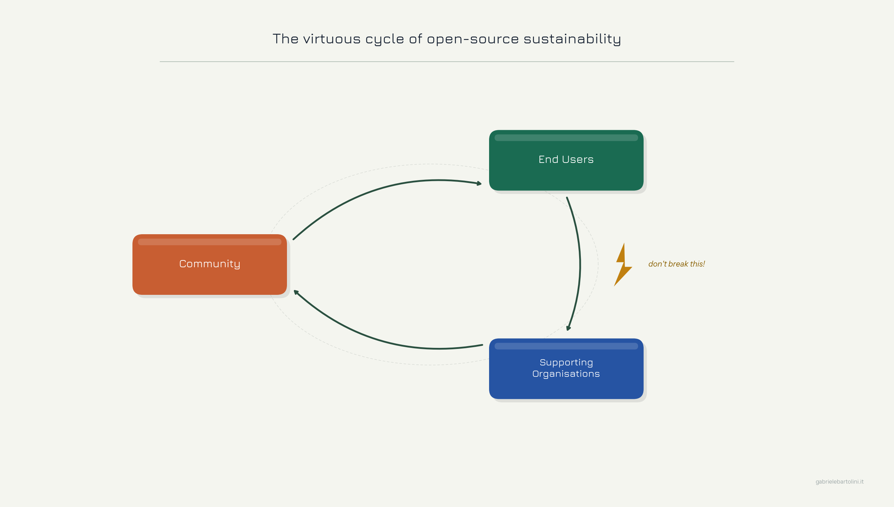

_Yesterday, David Steele announced the end of life of pgBackRest — a PostgreSQL
backup tool he maintained for thirteen years. The reasons are structural, not
personal, and they are a reminder of a pattern we see too often in open-source
infrastructure. This article reflects on what that means, on the architectural
rivalry between pgBackRest and Barman, and on why CloudNativePG users can take
confidence from both the project's CNCF governance and the virtuous cycle of
commercial support that sustains it._

<!--more-->

---

## A chapter closes

Yesterday, David Steele [announced](https://github.com/pgbackrest/pgbackrest#notice-of-obsolescence)
that pgBackRest — a project he has poured thirteen years of his professional
life into — will no longer be maintained.
He chose, of all days, my birthday to archive it. The announcement is
clear-eyed and dignified: after Crunchy Data was sold, he was unable to secure
a new position or sponsorship that would let him continue the work properly.
Rather than let the project decay through sporadic, under-resourced
maintenance, he chose a clean stop.

## A story of productive rivalry

I should declare an interest here. I am the creator of
[Barman](https://pgbarman.org/), the PostgreSQL backup and recovery tool that
predates pgBackRest. [Barman 1.0 was released in July 2012](https://www.postgresql.org/about/news/announcing-barman-10-backup-and-recovery-manager-for-postgresql-1403/),
after nearly two years of closed-source development, open sourced with the
support of European research funding through the 4Caast project. Since 2019,
when I turned my full attention to Kubernetes and what would become
CloudNativePG, I have not been involved in Barman — which continues to evolve
under EDB — but its origins are primarily mine and Marco Nenciarini's, with
a team that grew steadily around it at 2ndQuadrant and later EDB.

The name itself tells the story. Barman stands for Backup and Recovery
Manager — chosen to name a gap that PostgreSQL had at the time, and that in my
view it still has today. The name also carried a deliberate echo of Oracle's
RMAN, and not coincidentally: Barman's earliest customers and sponsors at
2ndQuadrant were DBAs making exactly that journey, from Oracle to PostgreSQL,
who needed a familiar frame of reference for backup and recovery. PostgreSQL ships `pg_basebackup`, a solid tool for
taking base backups, but there is no `pg_baserecovery` counterpart. The
restore side of DR has always been left to the DBA with
custom tooling or to third-party tooling. Barman was built to provide the complete solution: not
just capturing backups, but managing the full lifecycle of backup and recovery
for a PostgreSQL deployment.

When we designed Barman, we made a deliberate architectural choice: we would
not reinvent a data copy mechanism inside the tool. We believed that
functionality belonged inside PostgreSQL itself, and that a backup tool should
be built around the primitives the database already provides — primitives that
2ndQuadrant was itself actively contributing to improve. In the early years,
that meant rsync over SSH for file transfer to and from the PostgreSQL
server — battle-tested, ubiquitous, and not something we needed to rewrite.
We trusted PostgreSQL and the surrounding ecosystem to own data movement; our
job was orchestration, retention and recovery management.
The initial licence was deliberately GPL 3, with intellectual property held by
2ndQuadrant — a structural choice designed to ensure the project remained
fundable and that the company could build a sustainable commercial ecosystem
around it, alongside other tools we were developing for PostgreSQL at the time,
including repmgr.

Worth noting: `pg_basebackup` did not exist when Barman was first developed as
closed-source software for 2ndQuadrant customers. It arrived in PostgreSQL 9.1
in 2011, by which point Barman was already in use; when we open-sourced it in
2012, `pg_basebackup` was brand new. The delay in adopting it was not oversight. Around 2015, Simon Riggs, Marco
and I [worked on a proposal](https://wiki.postgresql.org/wiki/Incremental_backup)
to add native incremental backup and restore support directly to PostgreSQL —
the right place for it, consistent with everything Barman stood for, and even
anticipating a `pg_restorebackup` tool that, over time, would have addressed the very gap
I described above. We failed to get it through. The attempt consumed a
significant amount of our time, delayed Barman's development and, I'll admit,
took a personal toll: I came to the conclusion that developing PostgreSQL core
was not for me — or perhaps, more honestly, that I was not fit for it. We eventually
[integrated `pg_basebackup` into Barman 2.0](https://www.postgresql.org/about/news/barman-20-released-1702/)
in 2016, and it was the right call. But we tried to do it the harder way
first. Fortunately, Robert Haas eventually introduced incremental backup support
natively in PostgreSQL 17, starting from scratch — proof, if any were
needed, that the idea was right all along. The restore side, including network
transfer, remains unimplemented to this day: another gap still waiting to be
filled.

David was an early Barman user. He disagreed, fundamentally, with that approach. His
conviction was that the copy mechanism should live inside the backup tool,
where it could be fully controlled. Rather than file a feature request or write
a lengthy post arguing the point, he built pgBackRest. He put his conviction
into code and let the community judge.

That is the most honest form of technical disagreement I know. For years, both
projects thrived. The competition was real, the architectural differences were
real, and I believe each project was sharper for the existence of the other. I
have always had deep respect for David precisely because I understood the
seriousness of the choice he made and what it took to sustain it.

## The structural problem

But yesterday's news is not really about David. It is about a recurring, systemic
pattern in open-source software that does not get enough attention.

Building and maintaining a critical open-source infrastructure project is not a
side project. It demands deep expertise, sustained attention and a willingness
to absorb the long tail of edge cases that only production deployments surface.
It requires the ability to say no to the wrong contributions while staying
welcoming to the right ones. That is a full-time job, and full-time jobs
require income.

When corporate sponsorship disappears and community sponsorship cannot fill the
gap, maintainers face an impossible choice: do it poorly, or stop. David chose
the latter. He is not the first, and he will not be the last.

Open source is not free. It is, in the long run, a remarkable gift to the
world. But someone has to pay for the work that makes it reliable. Nadia
Eghbal documented this pattern exhaustively in
[Roads and Bridges](https://www.fordfoundation.org/learning/library/research-reports/roads-and-bridges-the-unseen-labor-behind-our-digital-infrastructure/)
as far back as 2016. Nothing has fundamentally changed since.

## CloudNativePG and structural protection

This is where I want to speak directly to CloudNativePG users.

CloudNativePG's [acceptance into the CNCF Sandbox](https://github.com/cncf/sandbox/issues/128)
is not a trophy on the shelf. It is a structural guarantee. It means that
CloudNativePG's [governance](https://github.com/cloudnative-pg/governance/blob/main/GOVERNANCE.md),
its intellectual property and its continuity are protected by a vendor-neutral,
transparently governed foundation — independent of any single company, employer
or sponsor. Even if EDB were to change direction tomorrow, the project could
not simply be shut down or captured. The software remains open source
regardless of what happens to any single organisation behind it.

The CNCF maturity ladder matters here. Sandbox is the entry point: governance
is formalised and the project commits to open-source principles. [Incubation](https://github.com/cncf/toc/issues/1961) —
the second stage we are working towards — requires demonstrated adoption across
multiple organisations. Graduation, the final stage, is the structural
milestone that ensures no single organisation can ever hold the project's
future hostage: it demands a healthy contributor and maintainer base that
extends well beyond the founding company. That is the
destination, and every adopter who runs CloudNativePG in production and engages
with the community brings us closer to it.

In my view — and I acknowledge I am not an unbiased observer here —
pgBackRest, for all its technical merit, was a solo-maintained project with no
equivalent structural protection. CloudNativePG is not. If you want to see the
health and contributor activity of the project for yourself,
[Linux Foundation Insights](https://insights.linuxfoundation.org/project/cloudnativepg)
provides an open, real-time view. That transparency is part of what vendor-neutral
governance means in practice.

## The virtuous cycle

Structural protection is necessary, but it does not write code.

The model that makes open source genuinely sustainable — not just alive, but
actively improving — is what I call the virtuous cycle. It is, in fact, the
diagram I always show customers when I introduce CloudNativePG.

A company invests in engineers who build and maintain open-source software;
that software creates real value for organisations running it in production;
those organisations buy commercial support and services from that company; the
company re-invests in engineers. Every link in the chain must hold.

I have lived this model for most of my career. At
[2ndQuadrant](),
under Simon Riggs' unique vision, we built a world-class PostgreSQL services
business on exactly this principle: a small but exceptional team of engineers,
funded by the organisations that relied on what they built. It worked because customers understood that their support
contracts were not just buying access to a helpdesk — they were sustaining the
people who wrote the software and who continued to improve it for everyone.

EDB is now taking that challenge to another level, at a much larger scale. Today, EDB funds
engineers working full-time on PostgreSQL itself, on CloudNativePG, on Barman,
on pgBouncer, and on the broader ecosystem. I want to say this publicly and
without reservation: I am deeply grateful to EDB's leadership for maintaining
that commitment. It is not a given. It requires genuine conviction to keep
investing in upstream open source when the returns are diffuse and the
timelines are long. The feedback loop between paying customers and open-source
engineers is one of the most underrated forces in software development — those
customer relationships bring real problems, the hard ones, the kind that push
software forward in ways that purely volunteer-driven projects rarely can.

If you are a CloudNativePG user and you have an EDB support subscription, you
are part of this cycle. Your contract helps sustain me and my colleague engineers
who maintain CloudNativePG, contribute to PostgreSQL upstream, and fix bugs
that affect the entire community — not just EDB customers. That is worth
understanding, and worth explaining to your procurement team when renewal comes
around.

One of the reasons EDB contributed CloudNativePG to the CNCF was precisely to
encourage other vendors to participate in the project and sustain their
contributions through their own support offerings. The
[CloudNativePG support page](https://cloudnative-pg.io/support/) lists the
organisations that today provide commercial support for the project. Every one
of them is a link in this chain — and every new one that joins brings us
closer to our aspiration of reaching CNCF Graduation within the next five
years, with a genuinely distributed contributor base that no single company
controls.

If you are not yet part of this cycle, I encourage you to consider it. Not as
a favour to any single vendor, but because the project you depend on is better
for every organisation that chooses to support it properly.

## To David

Thank you for thirteen years of exceptional work, and for the rivalry that made
both of us better. The way you have chosen to close this chapter says
everything about the kind of engineer — and person — you are.

---

Stay tuned for the upcoming recipes! For the latest updates, consider
subscribing to my [LinkedIn](https://www.linkedin.com/in/gbartolini/) and
[Twitter](https://twitter.com/_GBartolini_) channels.

If you found this article informative, feel free to share it within your
network on social media using the provided links below. Your support is
immensely appreciated!

_This article was drafted and refined with the assistance of Claude (Anthropic).
All technical content, corrections and editorial direction are the author's own._

